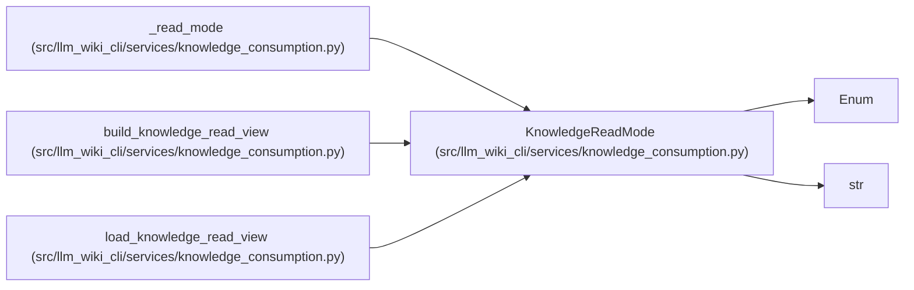

# KnowledgeReadMode

**Location:** `src/llm_wiki_cli/services/knowledge_consumption.py:51`
**Kind:** Enum
**Bases:** `str`, `Enum`
**Module:** [knowledge_consumption](../modules/knowledge_consumption.md)

## Description

Whether a read session evaluates live concept freshness.

## Attributes

| Name | Declared value | Description |
|------|-------|-------------|
| `EVALUATE_FRESHNESS` | `'evaluate-freshness'` | — |
| `DEFAULT` | `'evaluate-freshness'` | — |
| `SNAPSHOT_ONLY` | `'snapshot-only'` | — |

## Methods

*No public methods. Inherits from base classes.*

## Relationships

<!-- Auto-generated relationship summary. Do not edit by hand. -->

### Summary

| Module | Methods | Attributes |
|---|---:|---|
| [knowledge_consumption](../modules/knowledge_consumption.md) | 0 | `DEFAULT`, `EVALUATE_FRESHNESS`, `SNAPSHOT_ONLY` |

### Structure

| Kind | Entity | Module |
|---|---|---|
| Base | `Enum` | — |
| Base | `str` | — |

### References

| Reference | Kind | Source | Call sites |
|---|---|---|---:|
| `_read_mode` | call | [knowledge_consumption](../modules/knowledge_consumption.md) | 1 |
| `_read_mode` | type_reference | [knowledge_consumption](../modules/knowledge_consumption.md) | — |
| `build_knowledge_read_view` | type_reference | [knowledge_consumption](../modules/knowledge_consumption.md) | — |
| `load_knowledge_read_view` | type_reference | [knowledge_consumption](../modules/knowledge_consumption.md) | — |
