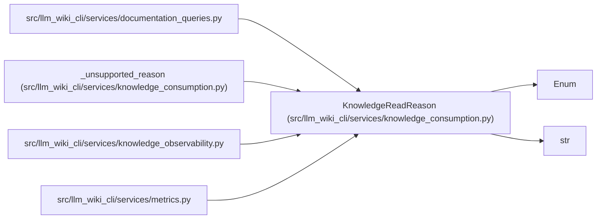

# KnowledgeReadReason

**Location:** `src/llm_wiki_cli/services/knowledge_consumption.py:59`
**Kind:** Enum
**Bases:** `str`, `Enum`
**Module:** [knowledge_consumption](../modules/knowledge_consumption.md)

## Description

Stable cross-consumer reasons for knowledge availability.

## Attributes

| Name | Declared value | Description |
|------|-------|-------------|
| `READY` | `'all-projection-commitments-match'` | — |
| `ABSENT` | `'knowledge-projection-not-present'` | — |
| `DEGRADED_INVALID` | `'policy-selected-surface-only-fallback-after-invalid'` | — |
| `DEGRADED_MIXED_SNAPSHOT` | `'policy-selected-surface-only-fallback-after-mixed-snapshot'` | — |
| `UNSUPPORTED_SCHEMA` | `'knowledge-schema-version-unsupported'` | — |
| `KNOWLEDGE_SCHEMA_VERSION_UNSUPPORTED` | `'knowledge-schema-version-unsupported'` | — |
| `MANIFEST_VERSION_UNSUPPORTED` | `'manifest-version-unsupported'` | — |
| `SURFACE_SCHEMA_VERSION_UNSUPPORTED` | `'surface-schema-version-unsupported'` | — |

## Methods

*No public methods. Inherits from base classes.*

## Relationships

<!-- Auto-generated relationship summary. Do not edit by hand. -->

### Summary

| Module | Methods | Attributes |
|---|---:|---|
| [knowledge_consumption](../modules/knowledge_consumption.md) | 0 | `ABSENT`, `DEGRADED_INVALID`, `DEGRADED_MIXED_SNAPSHOT`, `KNOWLEDGE_SCHEMA_VERSION_UNSUPPORTED`, `MANIFEST_VERSION_UNSUPPORTED`, `READY`, `SURFACE_SCHEMA_VERSION_UNSUPPORTED`, `UNSUPPORTED_SCHEMA` |

### Structure

| Kind | Entity | Module |
|---|---|---|
| Base | `Enum` | — |
| Base | `str` | — |

### References

| Reference | Kind | Source | Call sites |
|---|---|---|---:|
| `documentation_queries` | import | [documentation_queries](../modules/documentation_queries.md) | — |
| `_unsupported_reason` | type_reference | [knowledge_consumption](../modules/knowledge_consumption.md) | — |
| `knowledge_observability` | import | [knowledge_observability](../modules/knowledge_observability.md) | — |
| `metrics` | import | [metrics](../modules/metrics.md) | — |
