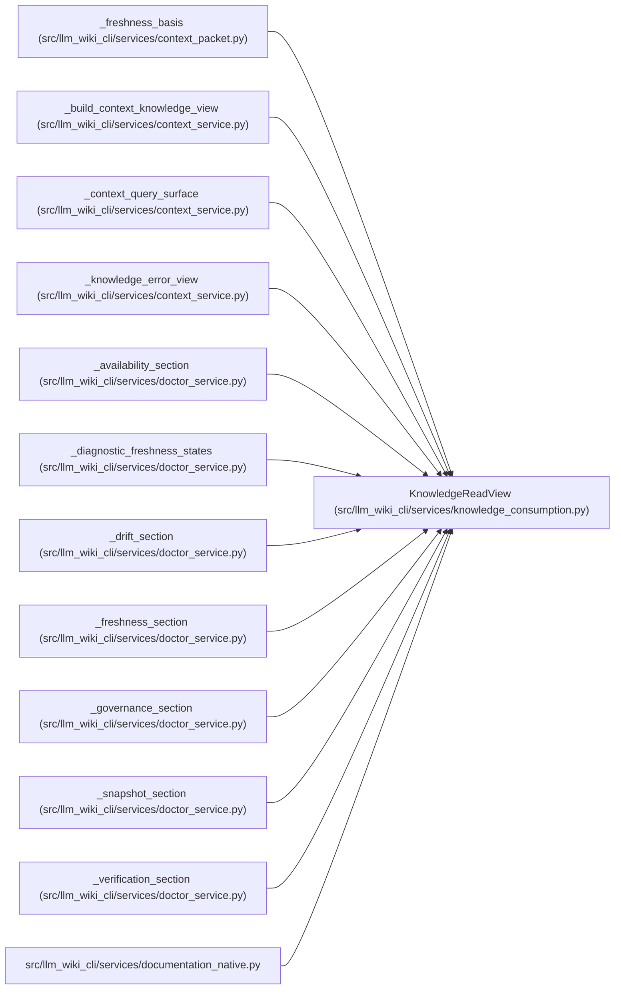

# KnowledgeReadView

**Location:** `src/llm_wiki_cli/services/knowledge_consumption.py:288`
**Kind:** Class
**Bases:** —
**Module:** [knowledge_consumption](../modules/knowledge_consumption.md)

**Decorators:** `@dataclass(frozen=True)`

## Description

Validated, immutable-by-contract state for one native read operation.

## Attributes

| Name | Type | Default | Description |
|------|------|---------|-------------|
| `availability` | `KnowledgeAvailability` | *required* | — |
| `mode` | `KnowledgeReadMode` | *required* | — |
| `reason` | `KnowledgeReadReason` | *required* | — |
| `surface` | `Mapping[str, Any] \| None` | *required* | — |
| `knowledge` | `KnowledgeIndex \| None` | *required* | — |
| `manifest_basis` | `SyncManifest \| None` | *required* | — |
| `freshness` | `KnowledgeFreshnessReport \| None` | *required* | — |
| `counts` | `KnowledgeReadCounts \| None` | *required* | — |
| `projection_findings` | `tuple[KnowledgeLoadIssue, ...]` | *required* | — |
| `load_state` | `KnowledgeLoadState` | *required* | — |
| `underlying_load_state` | `KnowledgeLoadState \| None` | `None` | — |
| `machine_verification` | `MachineVerificationReadView` | `field(default_factory=MachineVerificationReadView)` | — |

## Methods

| Method | Signature | Decorators | Description |
|--------|-----------|------------|-------------|
| `__post_init__` | `() -> None` | — | — |
| `reason_code` | `() -> str` | `@property` | — |
| `ready` | `() -> bool` | `@property` | — |
| `knowledge_available` | `() -> bool` | `@property` | — |
| `freshness_evaluated` | `() -> bool` | `@property` | — |
| `surface_payload` | `() -> Mapping[str, Any] \| None` | `@property` | — |
| `knowledge_index` | `() -> KnowledgeIndex \| None` | `@property` | — |
| `manifest` | `() -> SyncManifest \| None` | `@property` | — |
| `findings` | `() -> tuple[KnowledgeLoadIssue, ...]` | `@property` | — |

## Relationships

<!-- Auto-generated relationship summary. Do not edit by hand. -->

### Summary

| Module | Methods | Attributes |
|---|---:|---|
| [knowledge_consumption](../modules/knowledge_consumption.md) | 9 | `availability`, `counts`, `freshness`, `knowledge`, `load_state`, `machine_verification`, `manifest_basis`, `mode`, `projection_findings`, `reason`, `surface`, `underlying_load_state` |

### References

| Reference | Kind | Source |
|---|---|---|
| `_freshness_basis` | type_reference | [context_packet](../modules/context_packet.md) |
| `_build_context_knowledge_view` | type_reference | [context_service](../modules/context_service.md) |
| `_context_query_surface` | type_reference | [context_service](../modules/context_service.md) |
| `_knowledge_error_view` | type_reference | [context_service](../modules/context_service.md) |
| `_availability_section` | type_reference | [doctor_service](../modules/doctor_service.md) |
| `_diagnostic_freshness_states` | type_reference | [doctor_service](../modules/doctor_service.md) |
| `_drift_section` | type_reference | [doctor_service](../modules/doctor_service.md) |
| `_freshness_section` | type_reference | [doctor_service](../modules/doctor_service.md) |
| `_governance_section` | type_reference | [doctor_service](../modules/doctor_service.md) |
| `_snapshot_section` | type_reference | [doctor_service](../modules/doctor_service.md) |
| `_verification_section` | type_reference | [doctor_service](../modules/doctor_service.md) |
| `documentation_native` | import | [documentation_native](../modules/documentation_native.md) |
