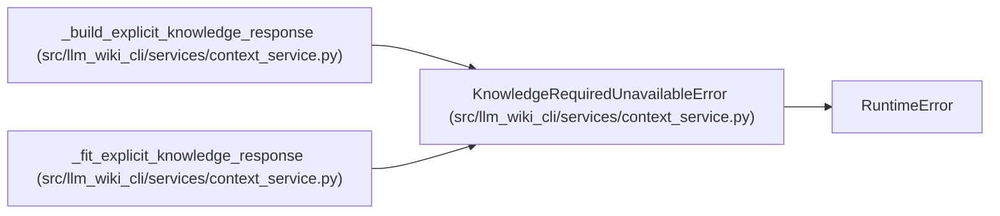

# KnowledgeRequiredUnavailableError

**Location:** `src/llm_wiki_cli/services/context_service.py:191`
**Kind:** Class
**Bases:** `RuntimeError`
**Module:** [context_service](../modules/context_service.md)

## Description

Explicit required mode could not produce ready qualified knowledge.

## Attributes

*No annotated attributes found.*

## Methods

| Method | Signature | Decorators | Description |
|--------|-----------|------------|-------------|
| `__init__` | `(*, availability: str, reason: str, fallback_evidence: list[str], recovery_command: str) -> None` | — | — |

## Relationships

<!-- Auto-generated relationship summary. Do not edit by hand. -->

### Summary

| Module | Methods | Attributes |
|---|---:|---|
| [context_service](../modules/context_service.md) | 1 | — |

### Structure

| Kind | Entity | Module |
|---|---|---|
| Base | `RuntimeError` | — |

### References

| Reference | Kind | Source |
|---|---|---|
| `_build_explicit_knowledge_response` | call | [context_service](../modules/context_service.md) |
| `_fit_explicit_knowledge_response` | call | [context_service](../modules/context_service.md) |
