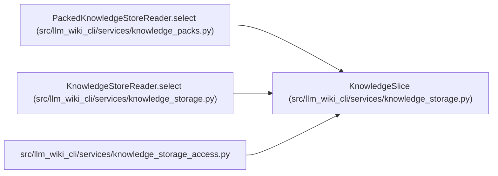

# KnowledgeSlice

**Location:** `src/llm_wiki_cli/services/knowledge_storage.py:454`
**Kind:** Class
**Bases:** —
**Module:** [knowledge_storage](../modules/knowledge_storage.md)

**Decorators:** `@dataclass(frozen=True)`

## Description

A detached canonical view of selected committed records. Its scope and unverified-record counts explicitly distinguish it from full artifact validation; converting it to a payload grants no freshness or execution authority.

## Attributes

| Name | Type | Default | Description |
|------|------|---------|-------------|
| `_bytes` | `bytes` | *required* | — |

## Methods

| Method | Signature | Decorators | Description |
|--------|-----------|------------|-------------|
| `to_payload` | `() -> dict[str, Any]` | — | — |

## Relationships

<!-- Auto-generated relationship summary. Do not edit by hand. -->

### Summary

| Module | Methods | Attributes |
|---|---:|---|
| [knowledge_storage](../modules/knowledge_storage.md) | 1 | `_bytes` |

### References

| Reference | Kind | Source | Call sites |
|---|---|---|---:|
| `PackedKnowledgeStoreReader.select` | call | [knowledge_packs](../modules/knowledge_packs.md) | 1 |
| `PackedKnowledgeStoreReader.select` | type_reference | [knowledge_packs](../modules/knowledge_packs.md) | — |
| `KnowledgeStoreReader.select` | call | [knowledge_storage](../modules/knowledge_storage.md) | 1 |
| `KnowledgeStoreReader.select` | type_reference | [knowledge_storage](../modules/knowledge_storage.md) | — |
| `knowledge_storage_access` | import | [knowledge_storage_access](../modules/knowledge_storage_access.md) | — |
