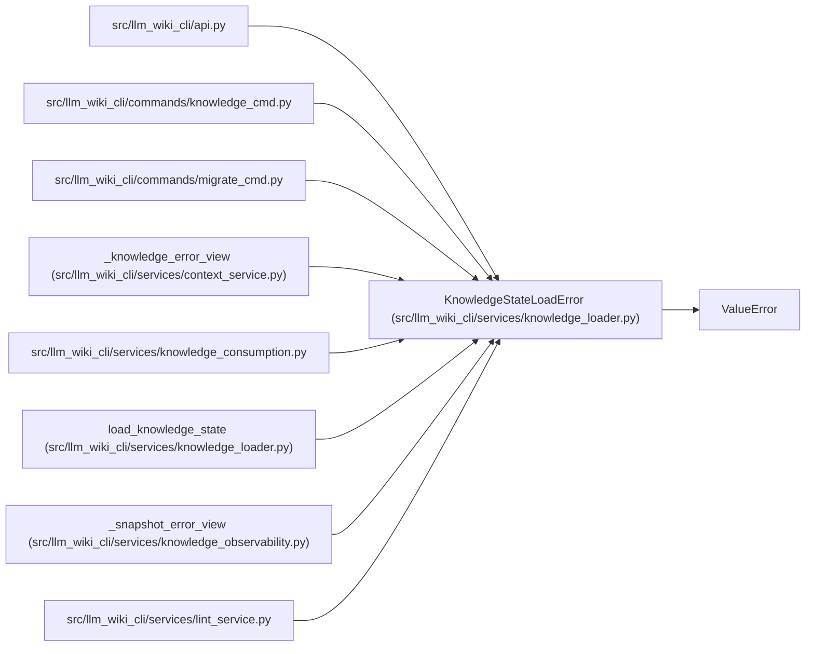

# KnowledgeStateLoadError

**Location:** `src/llm_wiki_cli/services/knowledge_loader.py:73`
**Kind:** Class
**Bases:** `ValueError`
**Module:** [knowledge_loader](../modules/knowledge_loader.md)

## Description

Raised by reject/rebuild policy when no valid state can be returned.

## Attributes

*No annotated attributes found.*

## Methods

| Method | Signature | Decorators | Description |
|--------|-----------|------------|-------------|
| `__init__` | `(status: KnowledgeLoadState, issues: tuple[KnowledgeLoadIssue, ...])` | — | — |

## Relationships

<!-- Auto-generated relationship summary. Do not edit by hand. -->

### Summary

| Module | Methods | Attributes |
|---|---:|---|
| [knowledge_loader](../modules/knowledge_loader.md) | 1 | — |

### Structure

| Kind | Entity | Module |
|---|---|---|
| Base | `ValueError` | — |

### References

| Reference | Kind | Source | Call sites |
|---|---|---|---:|
| `api` | import | [api](../modules/api.md) | — |
| `knowledge_cmd` | import | [knowledge_cmd](../modules/knowledge_cmd.md) | — |
| `migrate_cmd` | import | [migrate_cmd](../modules/migrate_cmd.md) | — |
| `_knowledge_error_view` | type_reference | [context_service](../modules/context_service.md) | — |
| `knowledge_consumption` | import | [knowledge_consumption](../modules/knowledge_consumption.md) | — |
| `load_knowledge_state` | call | [knowledge_loader](../modules/knowledge_loader.md) | 2 |
| `_snapshot_error_view` | type_reference | [knowledge_observability](../modules/knowledge_observability.md) | — |
| `lint_service` | import | [lint_service](../modules/lint_service.md) | — |
