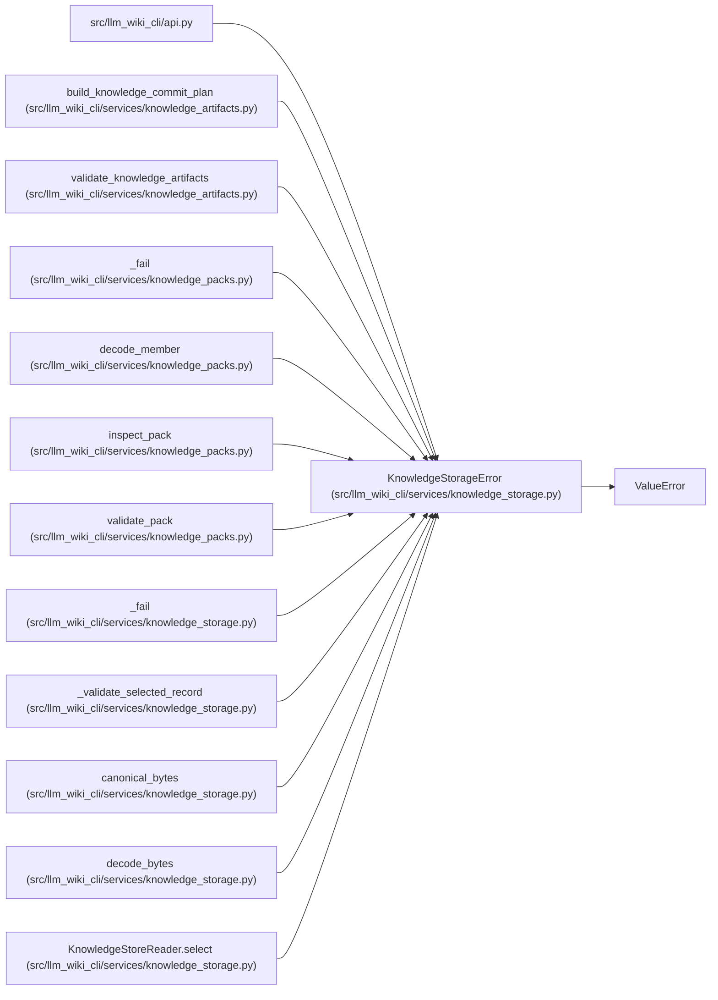

# KnowledgeStorageError

**Location:** `src/llm_wiki_cli/services/knowledge_storage.py:44`
**Kind:** Class
**Bases:** `ValueError`
**Module:** [knowledge_storage](../modules/knowledge_storage.md)

## Description

A field-specific storage failure with a stable code for malformed data, incompatible formats, mutation or bounded-work exhaustion. Callers preserve these distinctions when reporting unavailable or invalid native input.

## Attributes

*No annotated attributes found.*

## Methods

| Method | Signature | Decorators | Description |
|--------|-----------|------------|-------------|
| `__init__` | `(field: str, message: str, *, code: str = 'storage-invalid')` | — | — |

## Relationships

<!-- Auto-generated relationship summary. Do not edit by hand. -->

### Summary

| Module | Methods | Attributes |
|---|---:|---|
| [knowledge_storage](../modules/knowledge_storage.md) | 1 | — |

### Structure

| Kind | Entity | Module |
|---|---|---|
| Base | `ValueError` | — |

### References

| Reference | Kind | Source | Call sites |
|---|---|---|---:|
| `api` | import | [api](../modules/api.md) | — |
| `build_knowledge_commit_plan` | call | [knowledge_artifacts](../modules/knowledge_artifacts.md) | 1 |
| `validate_knowledge_artifacts` | call | [knowledge_artifacts](../modules/knowledge_artifacts.md) | 4 |
| `_fail` | call | [knowledge_packs](../modules/knowledge_packs.md) | 1 |
| `decode_member` | call | [knowledge_packs](../modules/knowledge_packs.md) | 1 |
| `inspect_pack` | call | [knowledge_packs](../modules/knowledge_packs.md) | 1 |
| `validate_pack` | call | [knowledge_packs](../modules/knowledge_packs.md) | 1 |
| `_fail` | call | [knowledge_storage](../modules/knowledge_storage.md) | 1 |
| `_validate_selected_record` | call | [knowledge_storage](../modules/knowledge_storage.md) | 1 |
| `canonical_bytes` | call | [knowledge_storage](../modules/knowledge_storage.md) | 1 |
| `decode_bytes` | call | [knowledge_storage](../modules/knowledge_storage.md) | 1 |
| `KnowledgeStoreReader.select` | call | [knowledge_storage](../modules/knowledge_storage.md) | 1 |

> References: showing 12 of 34 logical references; 22 omitted by the 12-row generated summary limit.
