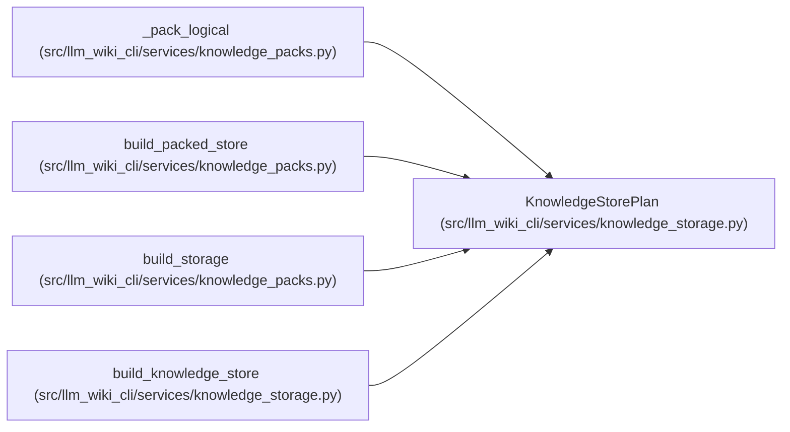

# KnowledgeStorePlan

**Location:** `src/llm_wiki_cli/services/knowledge_storage.py:179`
**Kind:** Class
**Bases:** —
**Module:** [knowledge_storage](../modules/knowledge_storage.md)

**Decorators:** `@dataclass(frozen=True)`

## Description

Holds the encoded root, exact immutable object bytes and storage statistics for one logical snapshot. Publication belongs to the artifact commit owner, so constructing a plan has no filesystem side effects.

## Attributes

| Name | Type | Default | Description |
|------|------|---------|-------------|
| `root_bytes` | `bytes` | *required* | — |
| `objects` | `Mapping[str, bytes]` | *required* | — |
| `statistics` | `Mapping[str, Any]` | *required* | — |
| `member_names` | `Mapping[str, str]` | `dataclass_field(default_factory=dict, repr=False)` | — |

## Methods

*No public methods. Inherits from base classes.*

## Relationships

<!-- Auto-generated relationship summary. Do not edit by hand. -->

### Summary

| Module | Methods | Attributes |
|---|---:|---|
| [knowledge_storage](../modules/knowledge_storage.md) | 0 | `member_names`, `objects`, `root_bytes`, `statistics` |

### References

| Reference | Kind | Source | Call sites |
|---|---|---|---:|
| `_pack_logical` | call | [knowledge_packs](../modules/knowledge_packs.md) | 1 |
| `build_packed_store` | type_reference | [knowledge_packs](../modules/knowledge_packs.md) | — |
| `build_storage` | type_reference | [knowledge_packs](../modules/knowledge_packs.md) | — |
| `build_knowledge_store` | call | [knowledge_storage](../modules/knowledge_storage.md) | 1 |
| `build_knowledge_store` | type_reference | [knowledge_storage](../modules/knowledge_storage.md) | — |
