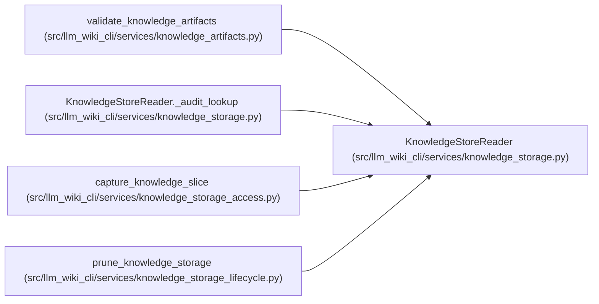

# KnowledgeStoreReader

**Location:** `src/llm_wiki_cli/services/knowledge_storage.py:463`
**Kind:** Class
**Bases:** —
**Module:** [knowledge_storage](../modules/knowledge_storage.md)

## Description

Traverses hash-bound catalogs and expands only the records needed by a selected read. It enforces encoded and expanded-data limits, validates routing ownership and preserves evidence multiplicity. Full materialization additionally audits the complete logical model and secondary indexes.

## Attributes

*No annotated attributes found.*

## Methods

| Method | Signature | Decorators | Description |
|--------|-----------|------------|-------------|
| `__init__` | `(root_bytes: bytes, read_object: Callable[[str, int], bytes], *, max_bytes: int = MAX_EXPANDED_BYTES, max_objects: int = MAX_READ_OBJECTS, max_expanded_bytes: int = MAX_EXPANDED_BYTES)` | — | — |
| `_check_budget` | `() -> None` | — | — |
| `_node` | `(desc: dict[str, Any], collection: str, prefix: str) -> dict[str, Any]` | — | — |
| `records` | `(collection: str, *, owner: str \| None = None, record_id: str \| None = None) -> Iterable[dict[str, Any]]` | — | — |
| `record` | `(collection: str, owner: str, record_id: str) -> dict[str, Any]` | — | — |
| `_charge_expanded` | `(amount: int) -> None` | — | — |
| `_expand` | `(value: Any, *, stack: tuple[str, ...] = (), depth: int = 0) -> Any` | — | — |
| `expand_record` | `(row: dict[str, Any]) -> Any` | — | — |
| `materialize` | `(*, audit_routes: bool = True) -> dict[str, Any]` | — | — |
| `_audit_lookup` | `(payload: dict[str, Any]) -> None` | — | — |
| `_lookup_references` | `(selector: str) -> Iterable[dict[str, str]]` | — | — |
| `_concept_owner` | `(locator: str) -> str` | — | — |
| `_record_aliases` | `(collection: str, row: dict[str, Any], value: Any) -> set[str]` | — | — |
| `select` | `(selectors: Iterable[str], *, max_records: int = 1000) -> KnowledgeSlice` | — | — |

## Relationships

<!-- Auto-generated relationship summary. Do not edit by hand. -->

### Summary

| Module | Methods | Attributes |
|---|---:|---|
| [knowledge_storage](../modules/knowledge_storage.md) | 14 | — |

### References

| Reference | Kind | Source | Call sites |
|---|---|---|---:|
| `validate_knowledge_artifacts` | call | [knowledge_artifacts](../modules/knowledge_artifacts.md) | 1 |
| `KnowledgeStoreReader._audit_lookup` | call | [knowledge_storage](../modules/knowledge_storage.md) | 1 |
| `capture_knowledge_slice` | call | [knowledge_storage_access](../modules/knowledge_storage_access.md) | 1 |
| `prune_knowledge_storage` | call | [knowledge_storage_lifecycle](../modules/knowledge_storage_lifecycle.md) | 1 |