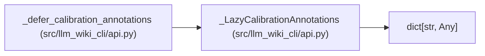

# _LazyCalibrationAnnotations

**Location:** `src/llm_wiki_cli/api.py:223`
**Kind:** Class
**Bases:** `dict[str, Any]`
**Module:** [api](../modules/api.md)

## Description

Load calibration types only when an annotation consumer evaluates them.

## Attributes

*No annotated attributes found.*

## Methods

| Method | Signature | Decorators | Description |
|--------|-----------|------------|-------------|
| `__init__` | `(annotations: Mapping[str, Any], *, exports: frozenset[str]) -> None` | — | — |
| `_resolve` | `() -> None` | — | — |
| `__getitem__` | `(key: str) -> Any` | — | — |
| `__iter__` | `() -> Iterator[str]` | — | — |
| `copy` | `() -> dict[str, Any]` | — | — |
| `items` | `() -> Any` | — | — |
| `keys` | `() -> Any` | — | — |
| `values` | `() -> Any` | — | — |

## Relationships

<!-- Auto-generated relationship summary. Do not edit by hand. -->

### Summary

| Module | Methods | Attributes |
|---|---:|---|
| [api](../modules/api.md) | 8 | — |

### Structure

| Kind | Entity | Module |
|---|---|---|
| Base | `dict[str, Any]` | — |

### References

| Reference | Kind | Source |
|---|---|---|
| `_defer_calibration_annotations` | call | [api](../modules/api.md) |
