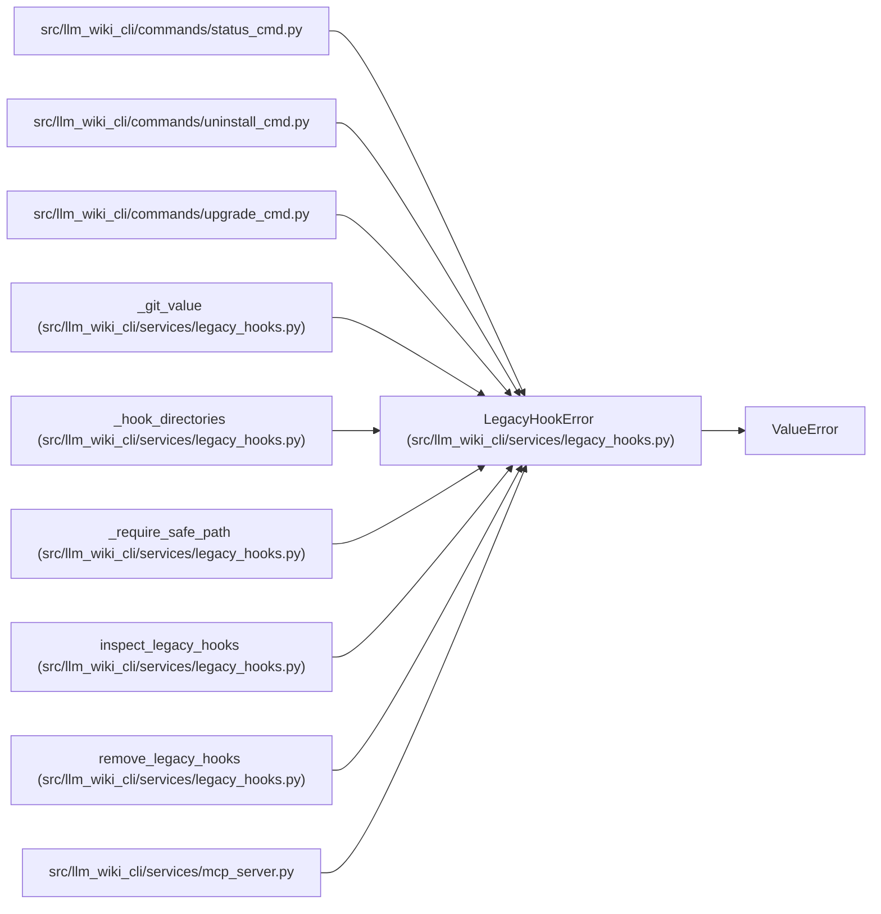

# LegacyHookError

**Location:** `src/llm_wiki_cli/services/legacy_hooks.py:24`
**Kind:** Class
**Bases:** `ValueError`
**Module:** [legacy_hooks](../modules/legacy_hooks.md)

## Description

Hook ownership or its filesystem snapshot cannot be verified safely.

## Attributes

*No annotated attributes found.*

## Methods

*No public methods. Inherits from base classes.*

## Relationships

<!-- Auto-generated relationship summary. Do not edit by hand. -->

### Summary

| Module | Methods | Attributes |
|---|---:|---|
| [legacy_hooks](../modules/legacy_hooks.md) | 0 | — |

### Structure

| Kind | Entity | Module |
|---|---|---|
| Base | `ValueError` | — |

### References

| Reference | Kind | Source | Call sites |
|---|---|---|---:|
| `status_cmd` | import | [status_cmd](../modules/status_cmd.md) | — |
| `uninstall_cmd` | import | [uninstall_cmd](../modules/uninstall_cmd.md) | — |
| `upgrade_cmd` | import | [upgrade_cmd](../modules/upgrade_cmd.md) | — |
| `_git_value` | call | [legacy_hooks](../modules/legacy_hooks.md) | 3 |
| `_hook_directories` | call | [legacy_hooks](../modules/legacy_hooks.md) | 2 |
| `_require_safe_path` | call | [legacy_hooks](../modules/legacy_hooks.md) | 1 |
| `inspect_legacy_hooks` | call | [legacy_hooks](../modules/legacy_hooks.md) | 3 |
| `remove_legacy_hooks` | call | [legacy_hooks](../modules/legacy_hooks.md) | 2 |
| `mcp_server` | import | [mcp_server](../modules/mcp_server.md) | — |
