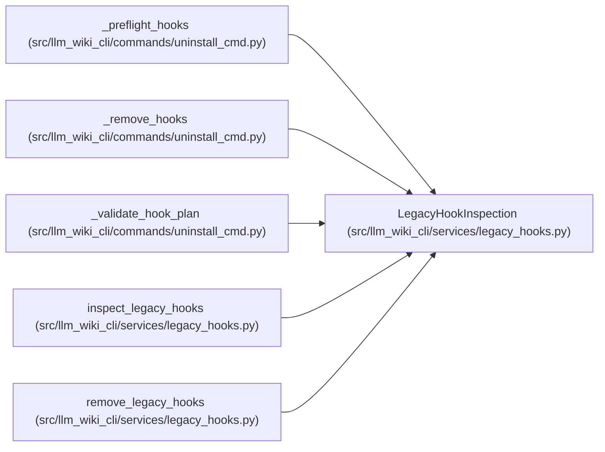

# LegacyHookInspection

**Location:** `src/llm_wiki_cli/services/legacy_hooks.py:29`
**Kind:** Class
**Bases:** —
**Module:** [legacy_hooks](../modules/legacy_hooks.md)

**Decorators:** `@dataclass(frozen=True)`

## Description

Exact hook bytes classified before a lifecycle operation changes files.

## Attributes

| Name | Type | Default | Description |
|------|------|---------|-------------|
| `name` | `str` | *required* | — |
| `path` | `Path` | *required* | — |
| `content` | `str` | *required* | — |
| `content_bytes` | `bytes` | *required* | — |
| `owned` | `bool` | *required* | — |

## Methods

*No public methods. Inherits from base classes.*

## Relationships

<!-- Auto-generated relationship summary. Do not edit by hand. -->

### Summary

| Module | Methods | Attributes |
|---|---:|---|
| [legacy_hooks](../modules/legacy_hooks.md) | 0 | `content`, `content_bytes`, `name`, `owned`, `path` |

### References

| Reference | Kind | Source | Call sites |
|---|---|---|---:|
| `_preflight_hooks` | type_reference | [uninstall_cmd](../modules/uninstall_cmd.md) | — |
| `_remove_hooks` | type_reference | [uninstall_cmd](../modules/uninstall_cmd.md) | — |
| `_validate_hook_plan` | type_reference | [uninstall_cmd](../modules/uninstall_cmd.md) | — |
| `inspect_legacy_hooks` | call | [legacy_hooks](../modules/legacy_hooks.md) | 1 |
| `inspect_legacy_hooks` | type_reference | [legacy_hooks](../modules/legacy_hooks.md) | — |
| `remove_legacy_hooks` | type_reference | [legacy_hooks](../modules/legacy_hooks.md) | — |
