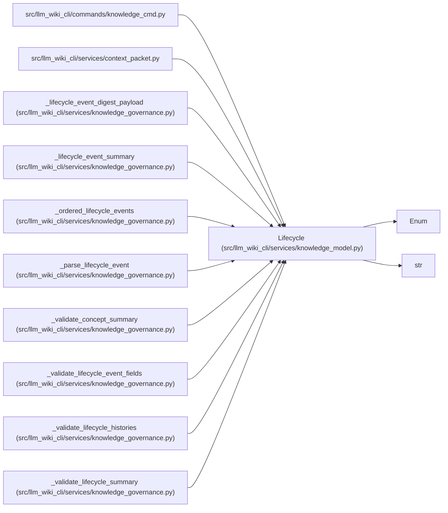

# Lifecycle

**Location:** `src/llm_wiki_cli/services/knowledge_model.py:162`
**Kind:** Enum
**Bases:** `str`, `Enum`
**Module:** [knowledge_model](../modules/knowledge_model.md)

## Description

_Auto-generated from `Lifecycle` in `src/llm_wiki_cli/services/knowledge_model.py`._

## Attributes

| Name | Declared value | Description |
|------|-------|-------------|
| `UNKNOWN` | `'unknown'` | — |
| `DRAFT` | `'draft'` | — |
| `ACTIVE` | `'active'` | — |
| `DEPRECATED` | `'deprecated'` | — |
| `SUPERSEDED` | `'superseded'` | — |

## Methods

*No public methods. Inherits from base classes.*

## Relationships

<!-- Auto-generated relationship summary. Do not edit by hand. -->

### Summary

| Module | Methods | Attributes |
|---|---:|---|
| [knowledge_model](../modules/knowledge_model.md) | 0 | `ACTIVE`, `DEPRECATED`, `DRAFT`, `SUPERSEDED`, `UNKNOWN` |

### Structure

| Kind | Entity | Module |
|---|---|---|
| Base | `Enum` | — |
| Base | `str` | — |

### References

| Reference | Kind | Source |
|---|---|---|
| `knowledge_cmd` | import | [knowledge_cmd](../modules/knowledge_cmd.md) |
| `context_packet` | import | [context_packet](../modules/context_packet.md) |
| `_lifecycle_event_digest_payload` | type_reference | [knowledge_governance](../modules/knowledge_governance.md) |
| `_lifecycle_event_summary` | type_reference | [knowledge_governance](../modules/knowledge_governance.md) |
| `_ordered_lifecycle_events` | type_reference | [knowledge_governance](../modules/knowledge_governance.md) |
| `_parse_lifecycle_event` | call | [knowledge_governance](../modules/knowledge_governance.md) |
| `_parse_lifecycle_event` | call | [knowledge_governance](../modules/knowledge_governance.md) |
| `_parse_lifecycle_event` | type_reference | [knowledge_governance](../modules/knowledge_governance.md) |
| `_validate_concept_summary` | call | [knowledge_governance](../modules/knowledge_governance.md) |
| `_validate_lifecycle_event_fields` | type_reference | [knowledge_governance](../modules/knowledge_governance.md) |
| `_validate_lifecycle_histories` | type_reference | [knowledge_governance](../modules/knowledge_governance.md) |
| `_validate_lifecycle_summary` | call | [knowledge_governance](../modules/knowledge_governance.md) |
