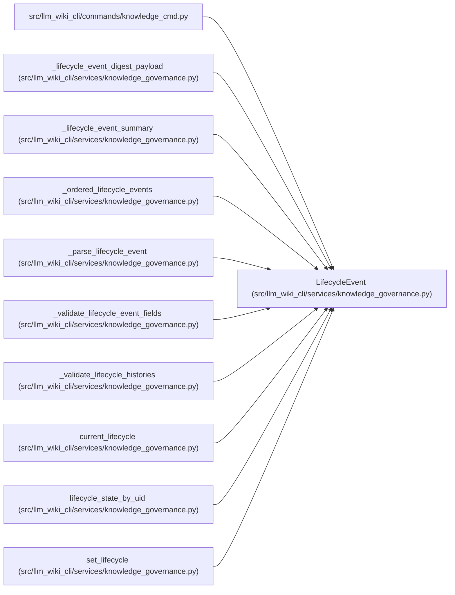

# LifecycleEvent

**Location:** `src/llm_wiki_cli/services/knowledge_governance.py:191`
**Kind:** Class
**Bases:** —
**Module:** [knowledge_governance](../modules/knowledge_governance.md)

**Decorators:** `@dataclass(frozen=True)`

## Description

One predecessor-linked lifecycle transition.

## Attributes

| Name | Type | Default | Description |
|------|------|---------|-------------|
| `event_id` | `str` | *required* | — |
| `concept_uid` | `str` | *required* | — |
| `previous_event_id` | `str \| None` | *required* | — |
| `from_state` | `Lifecycle` | *required* | — |
| `to_state` | `Lifecycle` | *required* | — |
| `actor` | `GovernanceActor` | *required* | — |
| `authored_at` | `str` | *required* | — |
| `reason` | `str` | *required* | — |
| `successor_uid` | `str \| None` | `None` | — |

## Methods

| Method | Signature | Decorators | Description |
|--------|-----------|------------|-------------|
| `to_payload` | `() -> dict[str, object]` | — | — |

## Relationships

<!-- Auto-generated relationship summary. Do not edit by hand. -->

### Summary

| Module | Methods | Attributes |
|---|---:|---|
| [knowledge_governance](../modules/knowledge_governance.md) | 1 | `actor`, `authored_at`, `concept_uid`, `event_id`, `from_state`, `previous_event_id`, `reason`, `successor_uid`, `to_state` |

### References

| Reference | Kind | Source | Call sites |
|---|---|---|---:|
| `knowledge_cmd` | import | [knowledge_cmd](../modules/knowledge_cmd.md) | — |
| `_lifecycle_event_digest_payload` | type_reference | [knowledge_governance](../modules/knowledge_governance.md) | — |
| `_lifecycle_event_summary` | type_reference | [knowledge_governance](../modules/knowledge_governance.md) | — |
| `_ordered_lifecycle_events` | type_reference | [knowledge_governance](../modules/knowledge_governance.md) | — |
| `_parse_lifecycle_event` | call | [knowledge_governance](../modules/knowledge_governance.md) | 1 |
| `_parse_lifecycle_event` | type_reference | [knowledge_governance](../modules/knowledge_governance.md) | — |
| `_validate_lifecycle_event_fields` | type_reference | [knowledge_governance](../modules/knowledge_governance.md) | — |
| `_validate_lifecycle_histories` | type_reference | [knowledge_governance](../modules/knowledge_governance.md) | — |
| `current_lifecycle` | type_reference | [knowledge_governance](../modules/knowledge_governance.md) | — |
| `lifecycle_state_by_uid` | type_reference | [knowledge_governance](../modules/knowledge_governance.md) | — |
| `set_lifecycle` | call | [knowledge_governance](../modules/knowledge_governance.md) | 1 |
