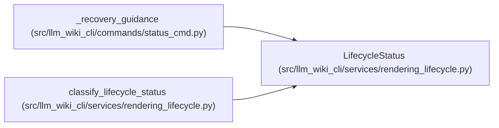

# LifecycleStatus

**Location:** `src/llm_wiki_cli/services/rendering_lifecycle.py:63`
**Kind:** Class
**Bases:** —
**Module:** [rendering_lifecycle](../modules/rendering_lifecycle.md)

**Decorators:** `@dataclass(frozen=True)`

## Description

Live status fields required by the managed lifecycle contract.

## Attributes

| Name | Type | Default | Description |
|------|------|---------|-------------|
| `state` | `ManagedLifecycleState` | *required* | — |
| `rendered_profile` | `str` | *required* | — |
| `reference_state` | `str` | *required* | — |
| `reference_path` | `str` | *required* | — |
| `reference_current` | `bool` | *required* | — |
| `read_only_knowledge` | `str` | *required* | — |
| `warning` | `str \| None` | *required* | — |
| `recovery_command` | `str \| None` | *required* | — |
| `config_mismatch` | `bool` | `False` | — |

## Methods

| Method | Signature | Decorators | Description |
|--------|-----------|------------|-------------|
| `to_dict` | `() -> dict[str, object]` | — | Return a deterministic machine-friendly representation. |

## Relationships

<!-- Auto-generated relationship summary. Do not edit by hand. -->

### Summary

| Module | Methods | Attributes |
|---|---:|---|
| [rendering_lifecycle](../modules/rendering_lifecycle.md) | 1 | `config_mismatch`, `read_only_knowledge`, `recovery_command`, `reference_current`, `reference_path`, `reference_state`, `rendered_profile`, `state`, `warning` |

### References

| Reference | Kind | Source | Call sites |
|---|---|---|---:|
| `_recovery_guidance` | type_reference | [status_cmd](../modules/status_cmd.md) | — |
| `classify_lifecycle_status` | call | [rendering_lifecycle](../modules/rendering_lifecycle.md) | 1 |
| `classify_lifecycle_status` | type_reference | [rendering_lifecycle](../modules/rendering_lifecycle.md) | — |
