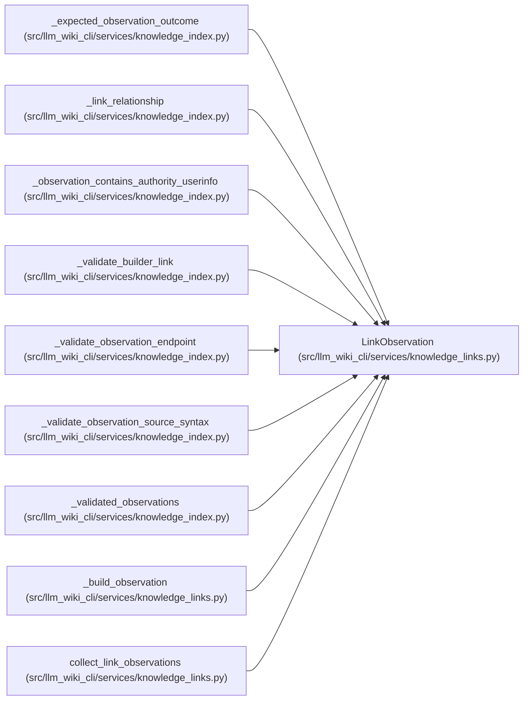

# LinkObservation

**Location:** `src/llm_wiki_cli/services/knowledge_links.py:71`
**Kind:** Class
**Bases:** —
**Module:** [knowledge_links](../modules/knowledge_links.md)

**Decorators:** `@dataclass(frozen=True)`

## Description

One lossless link occurrence and its deterministic resolution outcome.

## Attributes

| Name | Type | Default | Description |
|------|------|---------|-------------|
| `source_locator` | `str` | *required* | — |
| `source_canonical_path` | `str` | *required* | — |
| `raw_target` | `str` | *required* | — |
| `normalized_target` | `str` | *required* | — |
| `label` | `str` | *required* | — |
| `location` | `RelationshipLocation` | *required* | — |
| `target_class` | `TargetClass` | *required* | — |
| `resolution` | `Resolution` | *required* | — |
| `resolved_canonical_path` | `str \| None` | `None` | — |
| `external_uri` | `str \| None` | `None` | — |
| `syntax` | `LinkSyntax` | `LinkSyntax.MARKDOWN` | — |

## Methods

| Method | Signature | Decorators | Description |
|--------|-----------|------------|-------------|
| `source_page` | `() -> str` | `@property` | Compatibility shorthand for the source canonical path. |
| `canonical_path` | `() -> str \| None` | `@property` | Return the resolved canonical route, when one exists. |
| `resolved_canonical_route` | `() -> str \| None` | `@property` | Compatibility alias for the resolved canonical page path. |
| `start` | `() -> int` | `@property` | — |
| `end` | `() -> int` | `@property` | — |

## Relationships

<!-- Auto-generated relationship summary. Do not edit by hand. -->

### Summary

| Module | Methods | Attributes |
|---|---:|---|
| [knowledge_links](../modules/knowledge_links.md) | 5 | `external_uri`, `label`, `location`, `normalized_target`, `raw_target`, `resolution`, `resolved_canonical_path`, `source_canonical_path`, `source_locator`, `syntax`, `target_class` |

### References

| Reference | Kind | Source | Call sites |
|---|---|---|---:|
| `_expected_observation_outcome` | type_reference | [knowledge_index](../modules/knowledge_index.md) | — |
| `_link_relationship` | type_reference | [knowledge_index](../modules/knowledge_index.md) | — |
| `_observation_contains_authority_userinfo` | type_reference | [knowledge_index](../modules/knowledge_index.md) | — |
| `_validate_builder_link` | call | [knowledge_index](../modules/knowledge_index.md) | 1 |
| `_validate_observation_endpoint` | type_reference | [knowledge_index](../modules/knowledge_index.md) | — |
| `_validate_observation_source_syntax` | type_reference | [knowledge_index](../modules/knowledge_index.md) | — |
| `_validated_observations` | type_reference | [knowledge_index](../modules/knowledge_index.md) | — |
| `_build_observation` | call | [knowledge_links](../modules/knowledge_links.md) | 1 |
| `_build_observation` | type_reference | [knowledge_links](../modules/knowledge_links.md) | — |
| `collect_link_observations` | type_reference | [knowledge_links](../modules/knowledge_links.md) | — |
