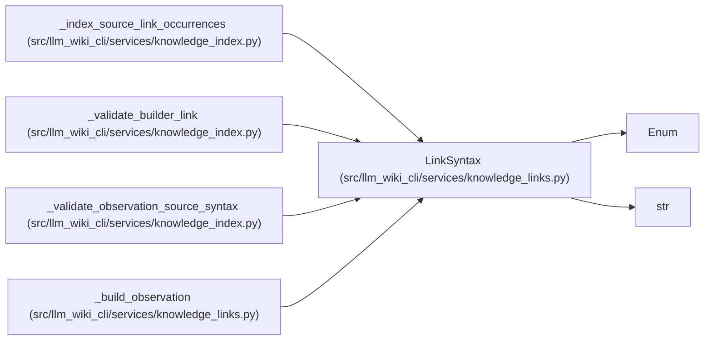

# LinkSyntax

**Location:** `src/llm_wiki_cli/services/knowledge_links.py:62`
**Kind:** Enum
**Bases:** `str`, `Enum`
**Module:** [knowledge_links](../modules/knowledge_links.md)

## Description

Source syntax that produced one Markdown-owned observation.

## Attributes

| Name | Declared value | Description |
|------|-------|-------------|
| `MARKDOWN` | `'markdown'` | — |
| `MARKDOWN_IMAGE` | `'markdown-image'` | — |
| `MERMAID_CLICK` | `'mermaid-click'` | — |

## Methods

*No public methods. Inherits from base classes.*

## Relationships

<!-- Auto-generated relationship summary. Do not edit by hand. -->

### Summary

| Module | Methods | Attributes |
|---|---:|---|
| [knowledge_links](../modules/knowledge_links.md) | 0 | `MARKDOWN`, `MARKDOWN_IMAGE`, `MERMAID_CLICK` |

### Structure

| Kind | Entity | Module |
|---|---|---|
| Base | `Enum` | — |
| Base | `str` | — |

### References

| Reference | Kind | Source |
|---|---|---|
| `_index_source_link_occurrences` | type_reference | [knowledge_index](../modules/knowledge_index.md) |
| `_validate_builder_link` | call | [knowledge_index](../modules/knowledge_index.md) |
| `_validate_observation_source_syntax` | type_reference | [knowledge_index](../modules/knowledge_index.md) |
| `_build_observation` | type_reference | [knowledge_links](../modules/knowledge_links.md) |
