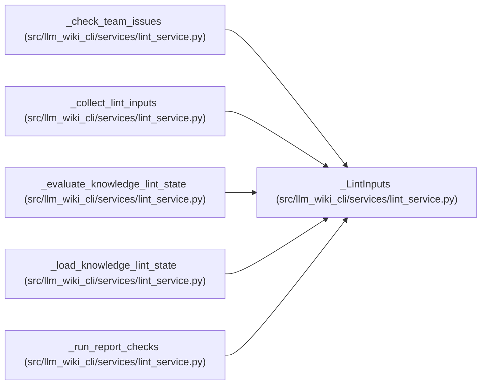

# _LintInputs

**Location:** `src/llm_wiki_cli/services/lint_service.py:315`
**Kind:** Class
**Bases:** —
**Module:** [lint_service](../modules/lint_service.md)

**Decorators:** `@dataclass(frozen=True)`

## Description

_Auto-generated from `_LintInputs` in `src/llm_wiki_cli/services/lint_service.py`._

## Attributes

| Name | Type | Default | Description |
|------|------|---------|-------------|
| `deep_inventory` | `dict` | *required* | — |
| `docker_inventory` | `dict` | *required* | — |
| `yaml_infrastructure_inventory` | `dict` | *required* | — |
| `page_index` | `_WikiPageIndex` | *required* | — |
| `unsupported_sources` | `dict[str, dict[str, object]]` | *required* | — |
| `source_snapshot` | `SourceSnapshot` | *required* | — |
| `inventory_result` | `InventoryResult` | *required* | — |
| `include_tests` | `frozenset[str]` | *required* | — |

## Methods

*No public methods. Inherits from base classes.*

## Relationships

<!-- Auto-generated relationship summary. Do not edit by hand. -->

### Summary

| Module | Methods | Attributes |
|---|---:|---|
| [lint_service](../modules/lint_service.md) | 0 | `deep_inventory`, `docker_inventory`, `include_tests`, `inventory_result`, `page_index`, `source_snapshot`, `unsupported_sources`, `yaml_infrastructure_inventory` |

### References

| Reference | Kind | Source |
|---|---|---|
| `_check_team_issues` | type_reference | [lint_service](../modules/lint_service.md) |
| `_collect_lint_inputs` | call | [lint_service](../modules/lint_service.md) |
| `_collect_lint_inputs` | type_reference | [lint_service](../modules/lint_service.md) |
| `_evaluate_knowledge_lint_state` | type_reference | [lint_service](../modules/lint_service.md) |
| `_load_knowledge_lint_state` | type_reference | [lint_service](../modules/lint_service.md) |
| `_run_report_checks` | type_reference | [lint_service](../modules/lint_service.md) |
