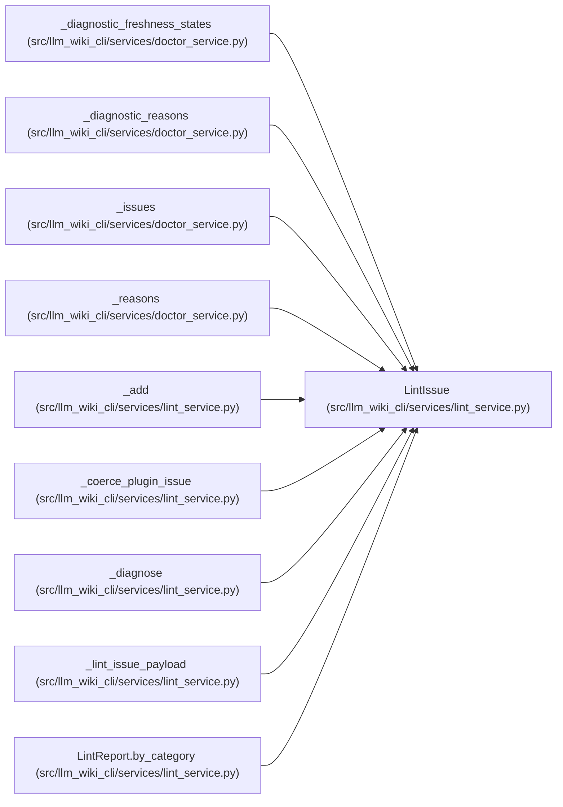

# LintIssue

**Location:** `src/llm_wiki_cli/services/lint_service.py:219`
**Kind:** Class
**Bases:** —
**Module:** [lint_service](../modules/lint_service.md)

**Decorators:** `@dataclass`

## Description

_Auto-generated from `LintIssue` in `src/llm_wiki_cli/services/lint_service.py`._

## Attributes

| Name | Type | Default | Description |
|------|------|---------|-------------|
| `category` | `str` | *required* | — |
| `message` | `str` | *required* | — |
| `severity` | `str` | `'error'` | — |
| `path` | `str \| None` | `None` | — |
| `target` | `str \| None` | `None` | — |
| `reason_code` | `str \| None` | `None` | — |
| `hint` | `str \| None` | `None` | — |

## Methods

*No public methods. Inherits from base classes.*

## Relationships

<!-- Auto-generated relationship summary. Do not edit by hand. -->

### Summary

| Module | Methods | Attributes |
|---|---:|---|
| [lint_service](../modules/lint_service.md) | 0 | `category`, `hint`, `message`, `path`, `reason_code`, `severity`, `target` |

### References

| Reference | Kind | Source |
|---|---|---|
| `_diagnostic_freshness_states` | type_reference | [doctor_service](../modules/doctor_service.md) |
| `_diagnostic_reasons` | type_reference | [doctor_service](../modules/doctor_service.md) |
| `_issues` | type_reference | [doctor_service](../modules/doctor_service.md) |
| `_reasons` | type_reference | [doctor_service](../modules/doctor_service.md) |
| `_add` | call | [lint_service](../modules/lint_service.md) |
| `_coerce_plugin_issue` | call | [lint_service](../modules/lint_service.md) |
| `_coerce_plugin_issue` | call | [lint_service](../modules/lint_service.md) |
| `_coerce_plugin_issue` | type_reference | [lint_service](../modules/lint_service.md) |
| `_diagnose` | call | [lint_service](../modules/lint_service.md) |
| `_lint_issue_payload` | type_reference | [lint_service](../modules/lint_service.md) |
| `LintReport.by_category` | type_reference | [lint_service](../modules/lint_service.md) |
