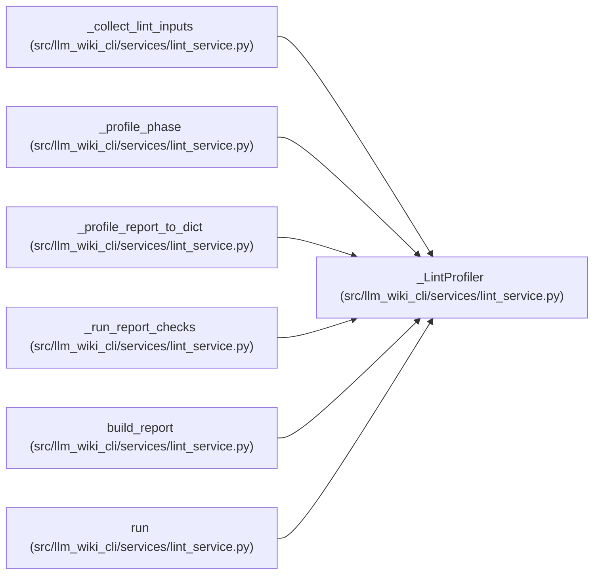

# _LintProfiler

**Location:** `src/llm_wiki_cli/services/lint_service.py:182`
**Kind:** Class
**Bases:** —
**Module:** [lint_service](../modules/lint_service.md)

## Description

_Auto-generated from `_LintProfiler` in `src/llm_wiki_cli/services/lint_service.py`._

## Attributes

*No annotated attributes found.*

## Methods

| Method | Signature | Decorators | Description |
|--------|-----------|------------|-------------|
| `__init__` | `() -> None` | — | — |
| `phase` | `(name: str) -> Iterator[None]` | `@contextmanager` | — |
| `to_dict` | `() -> dict` | — | — |

## Relationships

<!-- Auto-generated relationship summary. Do not edit by hand. -->

### Summary

| Module | Methods | Attributes |
|---|---:|---|
| [lint_service](../modules/lint_service.md) | 3 | — |

### References

| Reference | Kind | Source | Call sites |
|---|---|---|---:|
| `_collect_lint_inputs` | type_reference | [lint_service](../modules/lint_service.md) | — |
| `_profile_phase` | type_reference | [lint_service](../modules/lint_service.md) | — |
| `_profile_report_to_dict` | type_reference | [lint_service](../modules/lint_service.md) | — |
| `_run_report_checks` | type_reference | [lint_service](../modules/lint_service.md) | — |
| `build_report` | type_reference | [lint_service](../modules/lint_service.md) | — |
| `run` | call | [lint_service](../modules/lint_service.md) | 1 |
