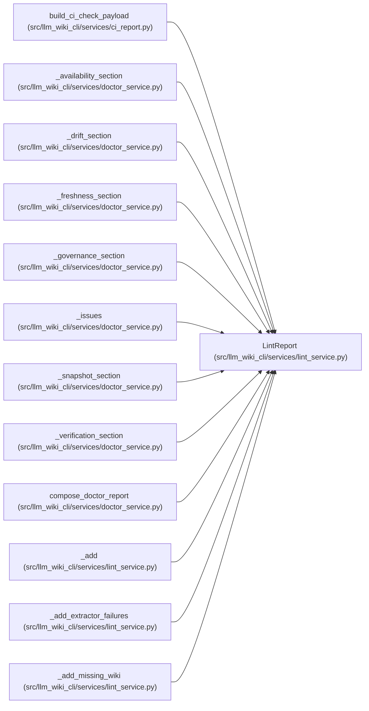

# LintReport

**Location:** `src/llm_wiki_cli/services/lint_service.py:268`
**Kind:** Class
**Bases:** —
**Module:** [lint_service](../modules/lint_service.md)

**Decorators:** `@dataclass`

## Description

_Auto-generated from `LintReport` in `src/llm_wiki_cli/services/lint_service.py`._

## Attributes

| Name | Type | Default | Description |
|------|------|---------|-------------|
| `wiki_dir` | `str` | *required* | — |
| `src_dir` | `str` | *required* | — |
| `strict` | `bool` | `False` | — |
| `issues` | `list[LintIssue]` | `field(default_factory=list)` | — |
| `diagnostics` | `list[LintIssue]` | `field(default_factory=list)` | — |
| `cache_stats` | `InventoryCacheStats \| None` | `None` | — |
| `extraction_job_plan` | `ExtractionJobPlan` | `field(default_factory=ExtractionJobPlan)` | — |
| `knowledge_summary` | `KnowledgeLintSummary \| None` | `None` | — |
| `knowledge_drift_report` | `bool` | `False` | — |
| `knowledge_enabled` | `bool` | `False` | — |
| `knowledge_view` | `KnowledgeReadView \| None` | `None` | — |

## Methods

| Method | Signature | Decorators | Description |
|--------|-----------|------------|-------------|
| `job_plan` | `() -> ExtractionJobPlan` | `@property` | — |
| `issue_count` | `() -> int` | `@property` | — |
| `passed` | `() -> bool` | `@property` | — |
| `by_category` | `() -> dict[str, list[LintIssue]]` | — | — |
| `count` | `(category: str) -> int` | — | — |

## Relationships

<!-- Auto-generated relationship summary. Do not edit by hand. -->

### Summary

| Module | Methods | Attributes |
|---|---:|---|
| [lint_service](../modules/lint_service.md) | 5 | `cache_stats`, `diagnostics`, `extraction_job_plan`, `issues`, `knowledge_drift_report`, `knowledge_enabled`, `knowledge_summary`, `knowledge_view`, `src_dir`, `strict`, `wiki_dir` |

### References

| Reference | Kind | Source | Call sites |
|---|---|---|---:|
| `build_ci_check_payload` | type_reference | [ci_report](../modules/ci_report.md) | — |
| `_availability_section` | type_reference | [doctor_service](../modules/doctor_service.md) | — |
| `_drift_section` | type_reference | [doctor_service](../modules/doctor_service.md) | — |
| `_freshness_section` | type_reference | [doctor_service](../modules/doctor_service.md) | — |
| `_governance_section` | type_reference | [doctor_service](../modules/doctor_service.md) | — |
| `_issues` | type_reference | [doctor_service](../modules/doctor_service.md) | — |
| `_snapshot_section` | type_reference | [doctor_service](../modules/doctor_service.md) | — |
| `_verification_section` | type_reference | [doctor_service](../modules/doctor_service.md) | — |
| `compose_doctor_report` | type_reference | [doctor_service](../modules/doctor_service.md) | — |
| `_add` | type_reference | [lint_service](../modules/lint_service.md) | — |
| `_add_extractor_failures` | type_reference | [lint_service](../modules/lint_service.md) | — |
| `_add_missing_wiki` | type_reference | [lint_service](../modules/lint_service.md) | — |

> References: showing 12 of 50 logical references; 38 omitted by the 12-row generated summary limit.
