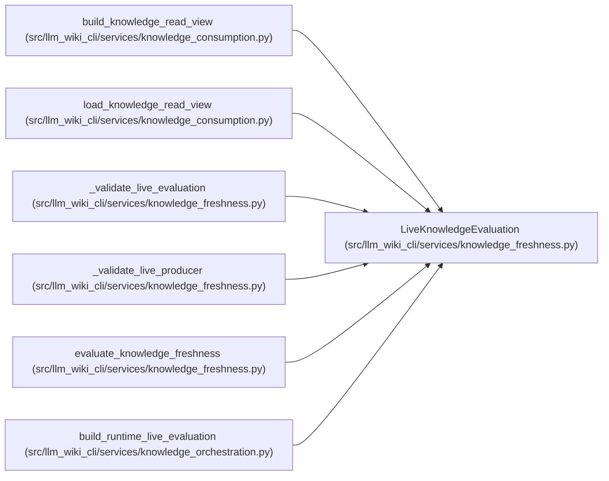

# LiveKnowledgeEvaluation

**Location:** `src/llm_wiki_cli/services/knowledge_freshness.py:159`
**Kind:** Class
**Bases:** —
**Module:** [knowledge_freshness](../modules/knowledge_freshness.md)

**Decorators:** `@dataclass(frozen=True)`

## Description

Already evaluated live inputs required for freshness comparison.

``source_content_hashes`` and ``missing_source_paths`` are path-wide so
sibling concepts cannot accidentally receive contradictory source status.
``concept_bases`` may include locators not present in the recorded index;
they are ignored because freshness is evaluated for recorded concepts.

## Attributes

| Name | Type | Default | Description |
|------|------|---------|-------------|
| `schema_version` | `str` | *required* | — |
| `producer` | `ProducerRecord` | *required* | — |
| `generation_options_hash` | `str` | *required* | — |
| `source_content_hashes` | `Mapping[str, str]` | *required* | — |
| `missing_source_paths` | `AbstractSet[str]` | `frozenset()` | — |
| `concept_bases` | `Mapping[str, ConceptObservationBasis]` | `field(default_factory=dict)` | — |

## Methods

*No public methods. Inherits from base classes.*

## Relationships

<!-- Auto-generated relationship summary. Do not edit by hand. -->

### Summary

| Module | Methods | Attributes |
|---|---:|---|
| [knowledge_freshness](../modules/knowledge_freshness.md) | 0 | `concept_bases`, `generation_options_hash`, `missing_source_paths`, `producer`, `schema_version`, `source_content_hashes` |

### References

| Reference | Kind | Source | Call sites |
|---|---|---|---:|
| `build_knowledge_read_view` | type_reference | [knowledge_consumption](../modules/knowledge_consumption.md) | — |
| `load_knowledge_read_view` | type_reference | [knowledge_consumption](../modules/knowledge_consumption.md) | — |
| `_validate_live_evaluation` | type_reference | [knowledge_freshness](../modules/knowledge_freshness.md) | — |
| `_validate_live_producer` | type_reference | [knowledge_freshness](../modules/knowledge_freshness.md) | — |
| `evaluate_knowledge_freshness` | type_reference | [knowledge_freshness](../modules/knowledge_freshness.md) | — |
| `build_runtime_live_evaluation` | call | [knowledge_orchestration](../modules/knowledge_orchestration.md) | 1 |
| `build_runtime_live_evaluation` | type_reference | [knowledge_orchestration](../modules/knowledge_orchestration.md) | — |
