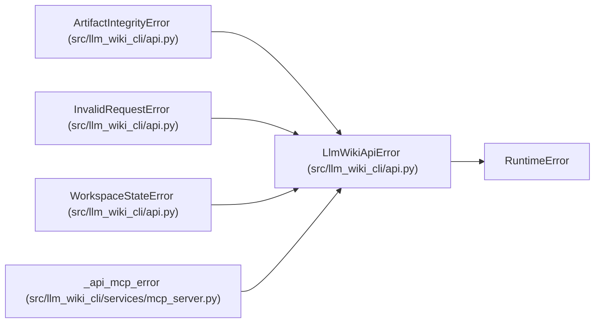

# LlmWikiApiError

**Location:** `src/llm_wiki_cli/api.py:317`
**Kind:** Class
**Bases:** `RuntimeError`
**Module:** [api](../modules/api.md)

## Description

Base exception raised by the supported Python API.

## Attributes

*No annotated attributes found.*

## Methods

| Method | Signature | Decorators | Description |
|--------|-----------|------------|-------------|
| `__init__` | `(message: str, *, code: str \| None = None, details: Mapping[str, Any] \| None = None) -> None` | — | — |

## Relationships

<!-- Auto-generated relationship summary. Do not edit by hand. -->

### Summary

| Module | Methods | Attributes |
|---|---:|---|
| [api](../modules/api.md) | 1 | — |

### Structure

| Kind | Entity | Module |
|---|---|---|
| Base | `RuntimeError` | — |
| Subclass | `ArtifactIntegrityError` | [api](../modules/api.md) |
| Subclass | `InvalidRequestError` | [api](../modules/api.md) |
| Subclass | `WorkspaceStateError` | [api](../modules/api.md) |

### References

| Reference | Kind | Source |
|---|---|---|
| `_api_mcp_error` | type_reference | [mcp_server](../modules/mcp_server.md) |
