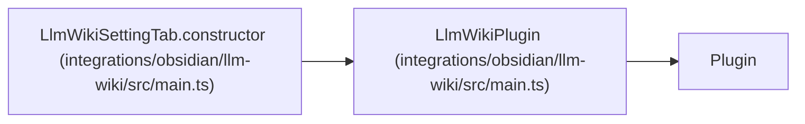

# LlmWikiPlugin

**Location:** `integrations/obsidian/llm-wiki/src/main.ts:129`
**Kind:** Class
**Bases:** `Plugin`
**Module:** [src_main](../modules/src_main.md)

## Description

Obsidian plugin entry point for operating on a canonical LLM Wiki from a vault.
On load it restores settings, registers export, sync, lint, status, context-copy,
and source-navigation commands, and adds the settings tab. Command execution
uses the configured CLI and project root; results are shown in notices or an
output modal rather than written into the active note.

## Attributes

| Name | Type | Default | Description |
|------|------|---------|-------------|
| `settings` | `LlmWikiSettings` | `DEFAULT_SETTINGS` | — |

## Methods

| Method | Signature | Decorators | Description |
|--------|-----------|------------|-------------|
| `onload` | *(async)* `()` | — | — |
| `saveSettings` | *(async)* `()` | — | — |
| `runAndShow` | *(async)* `(title: string, command: "export" \| "sync" \| "lint" \| "status")` | — | — |
| `copyContext` | *(async)* `()` | — | — |
| `openSourceLocation` | `()` | — | — |

## Relationships

<!-- Auto-generated relationship summary. Do not edit by hand. -->

### Summary

| Module | Methods | Attributes |
|---|---:|---|
| [src_main](../modules/src_main.md) | 5 | `settings` |

### Structure

| Kind | Entity | Module |
|---|---|---|
| Base | `Plugin` | — |

### References

| Reference | Kind | Source | Call sites |
|---|---|---|---:|
| `LlmWikiSettingTab.constructor` | type_reference | [src_main](../modules/src_main.md) | — |
