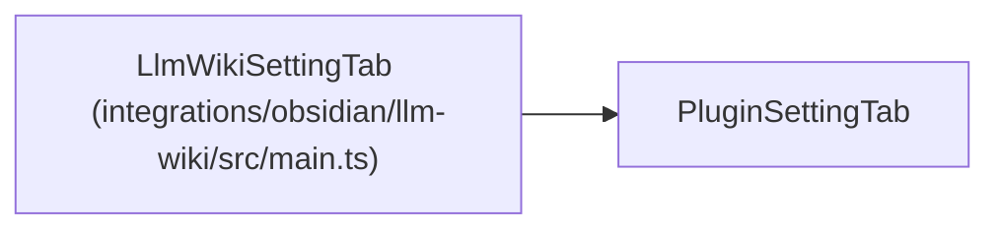

# LlmWikiSettingTab

**Location:** `integrations/obsidian/llm-wiki/src/main.ts:219`
**Kind:** Class
**Bases:** `PluginSettingTab`
**Module:** [src_main](../modules/src_main.md)

## Description

_Auto-generated from `LlmWikiSettingTab` in `integrations/obsidian/llm-wiki/src/main.ts`._

## Attributes

| Name | Type | Default | Description |
|------|------|---------|-------------|
| `plugin` | `LlmWikiPlugin` | *required* | — |

## Methods

| Method | Signature | Decorators | Description |
|--------|-----------|------------|-------------|
| `display` | `() -> void` | — | — |
| `textSetting` | `(name: string, desc: string, key: "cliPath" \| "projectRoot" \| "wikiDir" \| "vaultDir" \| "notesDir" \| "sourceUriTemplate")` | — | — |
| `constructor` | `(app: App, plugin: LlmWikiPlugin)` | — | — |

## Relationships

<!-- Auto-generated relationship summary. Do not edit by hand. -->

### Summary

| Module | Methods | Attributes |
|---|---:|---|
| [src_main](../modules/src_main.md) | 3 | `plugin` |

### Structure

| Kind | Entity | Module |
|---|---|---|
| Base | `PluginSettingTab` | — |
