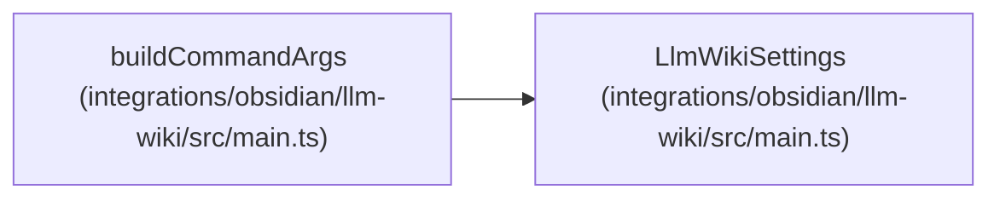

# LlmWikiSettings

**Location:** `integrations/obsidian/llm-wiki/src/main.ts:12`
**Kind:** Class
**Bases:** —
**Module:** [src_main](../modules/src_main.md)

## Description

_Auto-generated from `LlmWikiSettings` in `integrations/obsidian/llm-wiki/src/main.ts`._

## Attributes

| Name | Type | Default | Description |
|------|------|---------|-------------|
| `cliPath` | `string` | *required* | — |
| `projectRoot` | `string` | *required* | — |
| `wikiDir` | `string` | *required* | — |
| `vaultDir` | `string` | *required* | — |
| `notesDir` | `string` | *required* | — |
| `contextBudget` | `number` | *required* | — |
| `sourceUriTemplate` | `string` | *required* | — |

## Methods

*No public methods. Inherits from base classes.*

## Relationships

<!-- Auto-generated relationship summary. Do not edit by hand. -->

### Summary

| Module | Methods | Attributes |
|---|---:|---|
| [src_main](../modules/src_main.md) | 0 | `cliPath`, `contextBudget`, `notesDir`, `projectRoot`, `sourceUriTemplate`, `vaultDir`, `wikiDir` |

### References

| Reference | Kind | Source | Call sites |
|---|---|---|---:|
| `buildCommandArgs` | type_reference | [src_main](../modules/src_main.md) | — |
