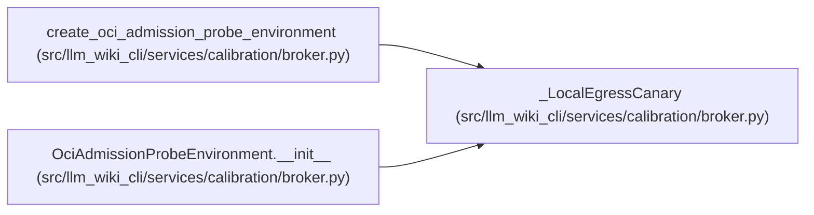

# _LocalEgressCanary

**Location:** `src/llm_wiki_cli/services/calibration/broker.py:1304`
**Kind:** Class
**Bases:** —
**Module:** [broker](../modules/broker.md)

## Description

Small host-loopback challenge server used only during one admission probe.

## Attributes

*No annotated attributes found.*

## Methods

| Method | Signature | Decorators | Description |
|--------|-----------|------------|-------------|
| `__init__` | `(*, probe_id: str) -> None` | — | — |
| `post_control_connections` | `() -> int` | `@property` | — |
| `assert_ready` | `() -> None` | — | — |
| `close` | `() -> None` | — | — |
| `_run_host_control` | `() -> None` | — | — |
| `_serve` | `() -> None` | — | — |

## Relationships

<!-- Auto-generated relationship summary. Do not edit by hand. -->

### Summary

| Module | Methods | Attributes |
|---|---:|---|
| [broker](../modules/broker.md) | 6 | — |

### References

| Reference | Kind | Source | Call sites |
|---|---|---|---:|
| `create_oci_admission_probe_environment` | call | [broker](../modules/broker.md) | 1 |
| `OciAdmissionProbeEnvironment.__init__` | type_reference | [broker](../modules/broker.md) | — |
