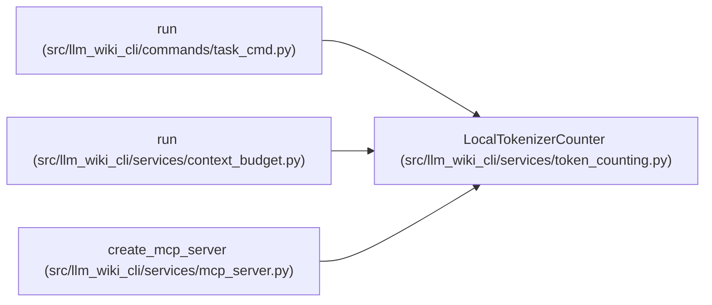

# LocalTokenizerCounter

**Location:** `src/llm_wiki_cli/services/token_counting.py:25`
**Kind:** Class
**Bases:** —
**Module:** [token_counting](../modules/token_counting.md)

## Description

Count raw text using immutable local tokenizer JSON, without framing.

## Attributes

*No annotated attributes found.*

## Methods

| Method | Signature | Decorators | Description |
|--------|-----------|------------|-------------|
| `__init__` | `(path: str \| Path)` | — | — |
| `count` | `(text: str) -> int` | — | — |

## Relationships

<!-- Auto-generated relationship summary. Do not edit by hand. -->

### Summary

| Module | Methods | Attributes |
|---|---:|---|
| [token_counting](../modules/token_counting.md) | 2 | — |

### References

| Reference | Kind | Source | Call sites |
|---|---|---|---:|
| `run` | call | [task_cmd](../modules/task_cmd.md) | 1 |
| `run` | call | [context_budget](../modules/context_budget.md) | 1 |
| `create_mcp_server` | call | [mcp_server](../modules/mcp_server.md) | 1 |
