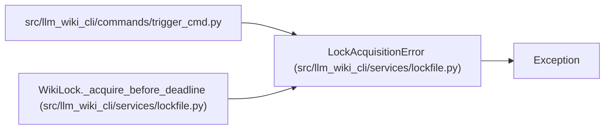

# LockAcquisitionError

**Location:** `src/llm_wiki_cli/services/lockfile.py:22`
**Kind:** Class
**Bases:** `Exception`
**Module:** [lockfile](../modules/lockfile.md)

## Description

Raised when the wiki lock cannot be acquired (another sync is running).

## Attributes

*No annotated attributes found.*

## Methods

*No public methods. Inherits from base classes.*

## Relationships

<!-- Auto-generated relationship summary. Do not edit by hand. -->

### Summary

| Module | Methods | Attributes |
|---|---:|---|
| [lockfile](../modules/lockfile.md) | 0 | — |

### Structure

| Kind | Entity | Module |
|---|---|---|
| Base | `Exception` | — |

### References

| Reference | Kind | Source |
|---|---|---|
| `trigger_cmd` | import | [trigger_cmd](../modules/trigger_cmd.md) |
| `WikiLock._acquire_before_deadline` | call | [lockfile](../modules/lockfile.md) |
| `WikiLock._acquire_before_deadline` | call | [lockfile](../modules/lockfile.md) |
