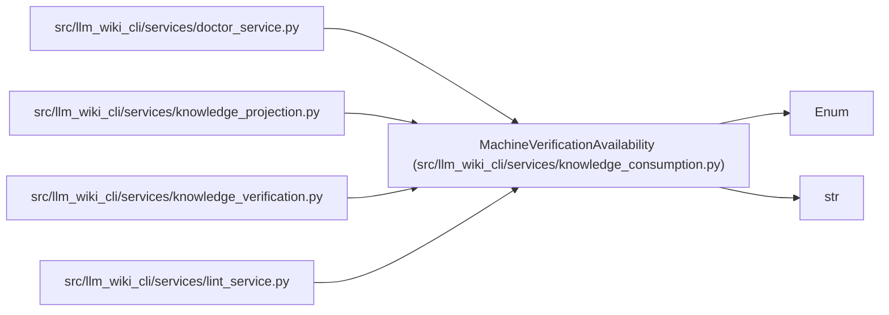

# MachineVerificationAvailability

**Location:** `src/llm_wiki_cli/services/knowledge_consumption.py:74`
**Kind:** Enum
**Bases:** `str`, `Enum`
**Module:** [knowledge_consumption](../modules/knowledge_consumption.md)

## Description

Whether the read session evaluated a disposable machine receipt.

## Attributes

| Name | Declared value | Description |
|------|-------|-------------|
| `NOT_EVALUATED` | `'not-evaluated'` | — |
| `ABSENT` | `'absent'` | — |
| `INVALID` | `'invalid'` | — |
| `RECORDED` | `'recorded'` | — |

## Methods

*No public methods. Inherits from base classes.*

## Relationships

<!-- Auto-generated relationship summary. Do not edit by hand. -->

### Summary

| Module | Methods | Attributes |
|---|---:|---|
| [knowledge_consumption](../modules/knowledge_consumption.md) | 0 | `ABSENT`, `INVALID`, `NOT_EVALUATED`, `RECORDED` |

### Structure

| Kind | Entity | Module |
|---|---|---|
| Base | `Enum` | — |
| Base | `str` | — |

### References

| Reference | Kind | Source | Call sites |
|---|---|---|---:|
| `doctor_service` | import | [doctor_service](../modules/doctor_service.md) | — |
| `knowledge_projection` | import | [knowledge_projection](../modules/knowledge_projection.md) | — |
| `knowledge_verification` | import | [knowledge_verification](../modules/knowledge_verification.md) | — |
| `lint_service` | import | [lint_service](../modules/lint_service.md) | — |
