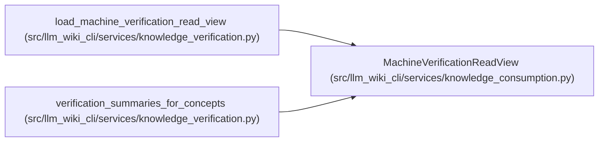

# MachineVerificationReadView

**Location:** `src/llm_wiki_cli/services/knowledge_consumption.py:112`
**Kind:** Class
**Bases:** —
**Module:** [knowledge_consumption](../modules/knowledge_consumption.md)

**Decorators:** `@dataclass(frozen=True)`

## Description

One receipt evaluation shared by all consumers in a read operation.

## Attributes

| Name | Type | Default | Description |
|------|------|---------|-------------|
| `availability` | `MachineVerificationAvailability` | `MachineVerificationAvailability.NOT_EVALUATED` | — |
| `reason` | `str` | `_MACHINE_REASON_NOT_EVALUATED` | — |
| `scope_kind` | `str` | `'unknown'` | — |
| `scope_uid` | `str \| None` | `None` | — |
| `scope_locator` | `str \| None` | `None` | — |
| `valid` | `bool \| None` | `None` | — |
| `invalidation_reasons` | `tuple[str, ...]` | `()` | — |
| `recorded_result` | `str \| None` | `None` | — |
| `passed` | `bool \| None` | `None` | — |
| `checks` | `Mapping[str, Mapping[str, Any]]` | `field(default_factory=lambda: MappingProxyType({}))` | — |

## Methods

| Method | Signature | Decorators | Description |
|--------|-----------|------------|-------------|
| `__post_init__` | `() -> None` | — | — |

## Relationships

<!-- Auto-generated relationship summary. Do not edit by hand. -->

### Summary

| Module | Methods | Attributes |
|---|---:|---|
| [knowledge_consumption](../modules/knowledge_consumption.md) | 1 | `availability`, `checks`, `invalidation_reasons`, `passed`, `reason`, `recorded_result`, `scope_kind`, `scope_locator`, `scope_uid`, `valid` |

### References

| Reference | Kind | Source | Call sites |
|---|---|---|---:|
| `load_machine_verification_read_view` | call | [knowledge_verification](../modules/knowledge_verification.md) | 4 |
| `load_machine_verification_read_view` | type_reference | [knowledge_verification](../modules/knowledge_verification.md) | — |
| `verification_summaries_for_concepts` | type_reference | [knowledge_verification](../modules/knowledge_verification.md) | — |
