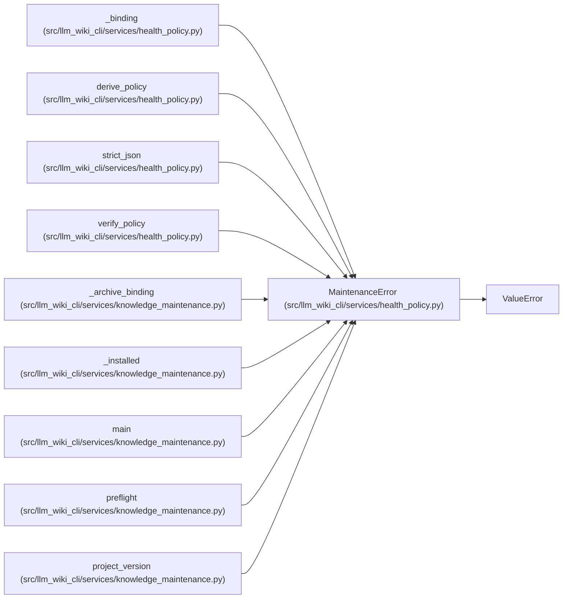

# MaintenanceError

**Location:** `src/llm_wiki_cli/services/health_policy.py:94`
**Kind:** Class
**Bases:** `ValueError`
**Module:** [health_policy](../modules/health_policy.md)

## Description

Maintenance evidence is absent, inconsistent or not bound to this candidate.

## Attributes

*No annotated attributes found.*

## Methods

*No public methods. Inherits from base classes.*

## Relationships

<!-- Auto-generated relationship summary. Do not edit by hand. -->

### Summary

| Module | Methods | Attributes |
|---|---:|---|
| [health_policy](../modules/health_policy.md) | 0 | — |

### Structure

| Kind | Entity | Module |
|---|---|---|
| Base | `ValueError` | — |

### References

| Reference | Kind | Source | Call sites |
|---|---|---|---:|
| `_binding` | call | [health_policy](../modules/health_policy.md) | 5 |
| `derive_policy` | call | [health_policy](../modules/health_policy.md) | 13 |
| `strict_json` | call | [health_policy](../modules/health_policy.md) | 2 |
| `verify_policy` | call | [health_policy](../modules/health_policy.md) | 1 |
| `_archive_binding` | call | [knowledge_maintenance](../modules/knowledge_maintenance.md) | 4 |
| `_installed` | call | [knowledge_maintenance](../modules/knowledge_maintenance.md) | 4 |
| `main` | call | [knowledge_maintenance](../modules/knowledge_maintenance.md) | 1 |
| `preflight` | call | [knowledge_maintenance](../modules/knowledge_maintenance.md) | 7 |
| `project_version` | call | [knowledge_maintenance](../modules/knowledge_maintenance.md) | 1 |
