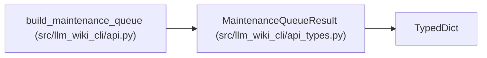

# MaintenanceQueueResult

**Location:** `src/llm_wiki_cli/api_types.py:80`
**Kind:** Class
**Bases:** `TypedDict`
**Module:** [api_types](../modules/api_types.md)

## Description

Advisory maintenance evidence with ranked reasons, ownership guidance, freshness qualification and exact result bounds. Recommendations do not edit pages, approve prose or change the integrity policy.

## Attributes

| Name | Type | Presence | Description |
|------|------|----------|-------------|
| `schema_version` | `str` | *required* | — |
| `advisory` | `bool` | *required* | — |
| `limit` | `int` | *required* | — |
| `total` | `int` | *required* | — |
| `returned` | `int` | *required* | — |
| `omitted` | `int` | *required* | — |
| `items` | `list[dict[str, Any]]` | *required* | — |
| `limitations` | `list[str]` | *required* | — |
| `diagnostics` | `list[dict[str, Any]]` | *required* | — |
| `basis` | `dict[str, Any]` | *required* | — |
| `queue_id` | `str` | *required* | — |

## Methods

*No public methods. Inherits from base classes.*

## Relationships

<!-- Auto-generated relationship summary. Do not edit by hand. -->

### Summary

| Module | Methods | Attributes |
|---|---:|---|
| [api_types](../modules/api_types.md) | 0 | `advisory`, `basis`, `diagnostics`, `items`, `limit`, `limitations`, `omitted`, `queue_id`, `returned`, `schema_version`, `total` |

### Structure

| Kind | Entity | Module |
|---|---|---|
| Base | `TypedDict` | — |

### References

| Reference | Kind | Source | Call sites |
|---|---|---|---:|
| `build_maintenance_queue` | type_reference | [api](../modules/api.md) | — |
