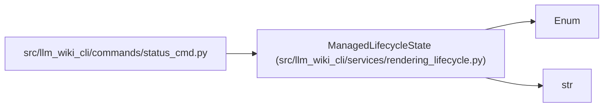

# ManagedLifecycleState

**Location:** `src/llm_wiki_cli/services/rendering_lifecycle.py:34`
**Kind:** Enum
**Bases:** `str`, `Enum`
**Module:** [rendering_lifecycle](../modules/rendering_lifecycle.md)

## Description

Stable live combinations reported by ``llm-wiki status``.

## Attributes

| Name | Declared value | Description |
|------|-------|-------------|
| `COMPACT_CURRENT` | `'compact/current'` | — |
| `EXPANDED_SKILLS_DISABLED` | `'expanded/skills-disabled'` | — |
| `EXPANDED_REFERENCE_UNAVAILABLE` | `'expanded/reference-unavailable'` | — |
| `EXPANDED_REFERENCE_CURRENT` | `'expanded/reference-current'` | — |
| `LEGACY_EXPANDED` | `'legacy-expanded'` | — |
| `COMPACT_BROKEN` | `'compact/broken'` | — |
| `MISSING_SCHEMA` | `'missing-schema'` | — |
| `UNSUPPORTED_SCHEMA` | `'unsupported-schema'` | — |
| `MALFORMED_SCHEMA` | `'malformed-schema'` | — |

## Methods

*No public methods. Inherits from base classes.*

## Relationships

<!-- Auto-generated relationship summary. Do not edit by hand. -->

### Summary

| Module | Methods | Attributes |
|---|---:|---|
| [rendering_lifecycle](../modules/rendering_lifecycle.md) | 0 | `COMPACT_BROKEN`, `COMPACT_CURRENT`, `EXPANDED_REFERENCE_CURRENT`, `EXPANDED_REFERENCE_UNAVAILABLE`, `EXPANDED_SKILLS_DISABLED`, `LEGACY_EXPANDED`, `MALFORMED_SCHEMA`, `MISSING_SCHEMA`, `UNSUPPORTED_SCHEMA` |

### Structure

| Kind | Entity | Module |
|---|---|---|
| Base | `Enum` | — |
| Base | `str` | — |

### References

| Reference | Kind | Source |
|---|---|---|
| `status_cmd` | import | [status_cmd](../modules/status_cmd.md) |
