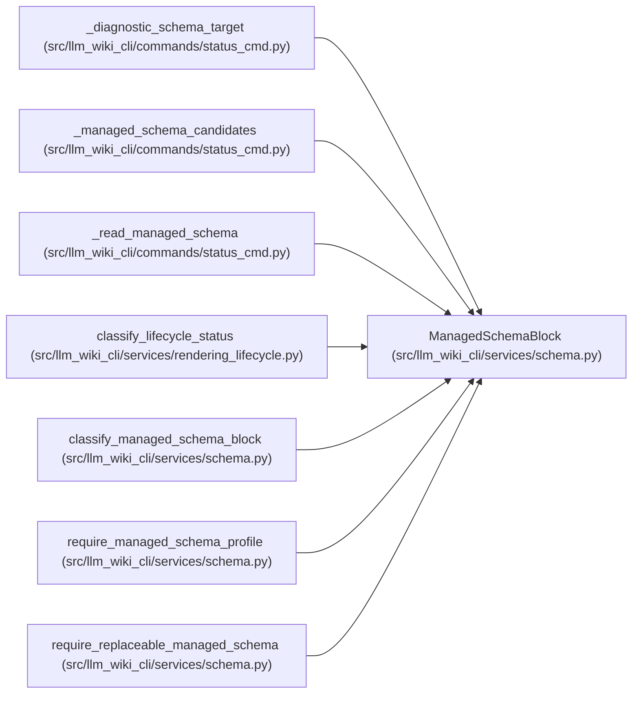

# ManagedSchemaBlock

**Location:** `src/llm_wiki_cli/services/schema.py:54`
**Kind:** Class
**Bases:** —
**Module:** [services_schema](../modules/services_schema.md)

**Decorators:** `@dataclass(frozen=True)`

## Description

Parsed metadata for a managed schema block without health inference.

## Attributes

| Name | Type | Default | Description |
|------|------|---------|-------------|
| `state` | `ManagedSchemaBlockState` | *required* | — |
| `profile` | `SchemaRenderProfile \| None` | `None` | — |
| `version` | `int \| None` | `None` | — |
| `raw_profile` | `str \| None` | `None` | — |

## Methods

*No public methods. Inherits from base classes.*

## Relationships

<!-- Auto-generated relationship summary. Do not edit by hand. -->

### Summary

| Module | Methods | Attributes |
|---|---:|---|
| [services_schema](../modules/services_schema.md) | 0 | `profile`, `raw_profile`, `state`, `version` |

### References

| Reference | Kind | Source | Call sites |
|---|---|---|---:|
| `_diagnostic_schema_target` | type_reference | [status_cmd](../modules/status_cmd.md) | — |
| `_managed_schema_candidates` | type_reference | [status_cmd](../modules/status_cmd.md) | — |
| `_read_managed_schema` | call | [status_cmd](../modules/status_cmd.md) | 4 |
| `_read_managed_schema` | type_reference | [status_cmd](../modules/status_cmd.md) | — |
| `classify_lifecycle_status` | type_reference | [rendering_lifecycle](../modules/rendering_lifecycle.md) | — |
| `classify_managed_schema_block` | call | [services_schema](../modules/services_schema.md) | 9 |
| `classify_managed_schema_block` | type_reference | [services_schema](../modules/services_schema.md) | — |
| `require_managed_schema_profile` | type_reference | [services_schema](../modules/services_schema.md) | — |
| `require_replaceable_managed_schema` | type_reference | [services_schema](../modules/services_schema.md) | — |
