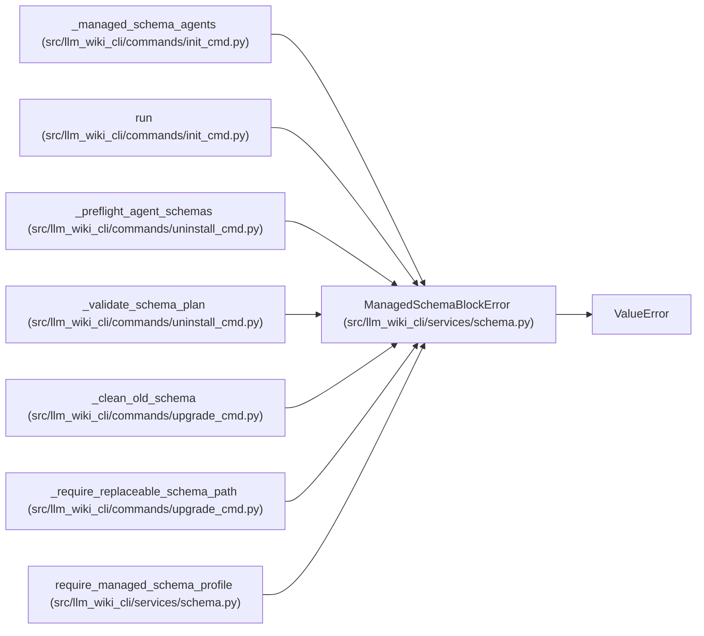

# ManagedSchemaBlockError

**Location:** `src/llm_wiki_cli/services/schema.py:49`
**Kind:** Class
**Bases:** `ValueError`
**Module:** [services_schema](../modules/services_schema.md)

## Description

Raised when a malformed managed block cannot be replaced safely.

## Attributes

*No annotated attributes found.*

## Methods

*No public methods. Inherits from base classes.*

## Relationships

<!-- Auto-generated relationship summary. Do not edit by hand. -->

### Summary

| Module | Methods | Attributes |
|---|---:|---|
| [services_schema](../modules/services_schema.md) | 0 | — |

### Structure

| Kind | Entity | Module |
|---|---|---|
| Base | `ValueError` | — |

### References

| Reference | Kind | Source |
|---|---|---|
| `_managed_schema_agents` | call | [init_cmd](../modules/init_cmd.md) |
| `run` | call | [init_cmd](../modules/init_cmd.md) |
| `run` | call | [init_cmd](../modules/init_cmd.md) |
| `run` | call | [init_cmd](../modules/init_cmd.md) |
| `run` | call | [init_cmd](../modules/init_cmd.md) |
| `_preflight_agent_schemas` | call | [uninstall_cmd](../modules/uninstall_cmd.md) |
| `_preflight_agent_schemas` | call | [uninstall_cmd](../modules/uninstall_cmd.md) |
| `_validate_schema_plan` | call | [uninstall_cmd](../modules/uninstall_cmd.md) |
| `_validate_schema_plan` | call | [uninstall_cmd](../modules/uninstall_cmd.md) |
| `_clean_old_schema` | call | [upgrade_cmd](../modules/upgrade_cmd.md) |
| `_require_replaceable_schema_path` | call | [upgrade_cmd](../modules/upgrade_cmd.md) |
| `require_managed_schema_profile` | call | [services_schema](../modules/services_schema.md) |
