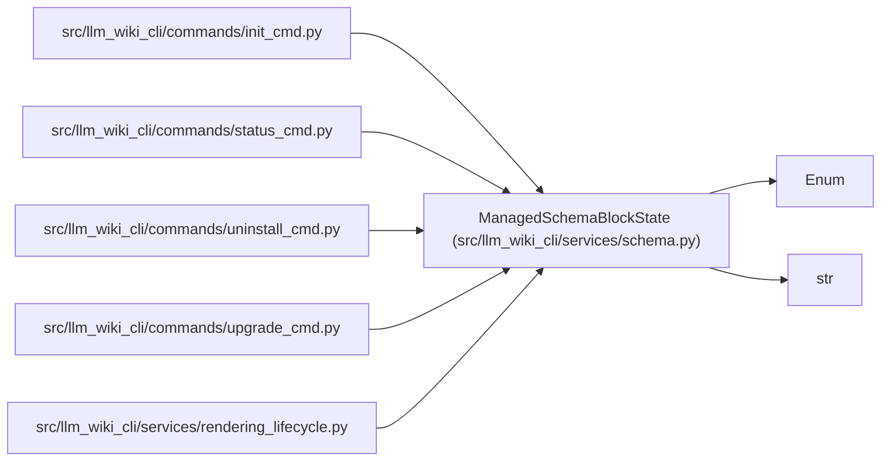

# ManagedSchemaBlockState

**Location:** `src/llm_wiki_cli/services/schema.py:34`
**Kind:** Enum
**Bases:** `str`, `Enum`
**Module:** [services_schema](../modules/services_schema.md)

## Description

Machine-readable classification of one managed schema block.

## Attributes

| Name | Declared value | Description |
|------|-------|-------------|
| `ABSENT` | `'absent'` | — |
| `LEGACY_EXPANDED_INLINE` | `'legacy-expanded-inline'` | — |
| `PROFILED` | `'profiled'` | — |
| `UNSUPPORTED_VERSION` | `'unsupported-version'` | — |
| `UNSUPPORTED_PROFILE` | `'unsupported-profile'` | — |
| `MALFORMED` | `'malformed'` | — |

## Methods

*No public methods. Inherits from base classes.*

## Relationships

<!-- Auto-generated relationship summary. Do not edit by hand. -->

### Summary

| Module | Methods | Attributes |
|---|---:|---|
| [services_schema](../modules/services_schema.md) | 0 | `ABSENT`, `LEGACY_EXPANDED_INLINE`, `MALFORMED`, `PROFILED`, `UNSUPPORTED_PROFILE`, `UNSUPPORTED_VERSION` |

### Structure

| Kind | Entity | Module |
|---|---|---|
| Base | `Enum` | — |
| Base | `str` | — |

### References

| Reference | Kind | Source |
|---|---|---|
| `init_cmd` | import | [init_cmd](../modules/init_cmd.md) |
| `status_cmd` | import | [status_cmd](../modules/status_cmd.md) |
| `uninstall_cmd` | import | [uninstall_cmd](../modules/uninstall_cmd.md) |
| `upgrade_cmd` | import | [upgrade_cmd](../modules/upgrade_cmd.md) |
| `rendering_lifecycle` | import | [rendering_lifecycle](../modules/rendering_lifecycle.md) |
