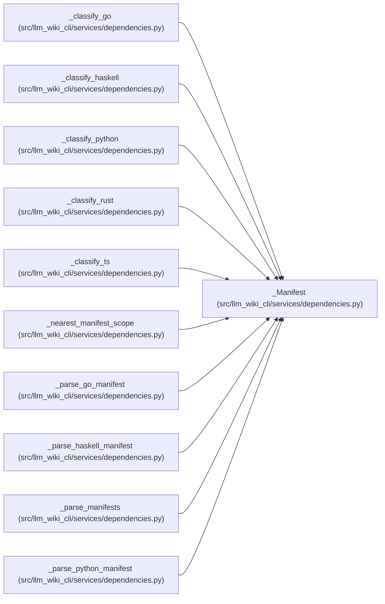

# _Manifest

**Location:** `src/llm_wiki_cli/services/dependencies.py:771`
**Kind:** Class
**Bases:** —
**Module:** [services_dependencies](../modules/services_dependencies.md)

**Decorators:** `@dataclass(frozen=True)`

## Description

A language's declared dependencies, parsed from its manifest.

``required`` are runtime dependencies; ``optional`` are extras/dev/build
dependencies (never counted "unused"). The remaining fields are
language-specific context for classification and default to inert values:
``own_module``/``internal_modules`` exclude Go intra-module imports, and
``aliases`` is the Python import→distribution map for project-local
distributions. Python ``[tool.llm-wiki] dependency-aliases`` overrides live
on matching scopes so nearest manifests can win. ``scopes`` is used by
languages where nested manifests apply only to files below their directory.

## Attributes

| Name | Type | Default | Description |
|------|------|---------|-------------|
| `required` | `frozenset[str]` | *required* | — |
| `optional` | `frozenset[str]` | *required* | — |
| `own_module` | `str` | `''` | — |
| `internal_modules` | `frozenset[str]` | `frozenset()` | — |
| `aliases` | `Optional[dict[str, str]]` | `None` | — |
| `scopes` | `tuple[_ManifestScope, ...]` | `()` | — |

## Methods

*No public methods. Inherits from base classes.*

## Relationships

<!-- Auto-generated relationship summary. Do not edit by hand. -->

### Summary

| Module | Methods | Attributes |
|---|---:|---|
| [services_dependencies](../modules/services_dependencies.md) | 0 | `aliases`, `internal_modules`, `optional`, `own_module`, `required`, `scopes` |

### References

| Reference | Kind | Source | Call sites |
|---|---|---|---:|
| `_classify_go` | type_reference | [services_dependencies](../modules/services_dependencies.md) | — |
| `_classify_haskell` | type_reference | [services_dependencies](../modules/services_dependencies.md) | — |
| `_classify_python` | type_reference | [services_dependencies](../modules/services_dependencies.md) | — |
| `_classify_rust` | type_reference | [services_dependencies](../modules/services_dependencies.md) | — |
| `_classify_ts` | type_reference | [services_dependencies](../modules/services_dependencies.md) | — |
| `_nearest_manifest_scope` | type_reference | [services_dependencies](../modules/services_dependencies.md) | — |
| `_parse_go_manifest` | call | [services_dependencies](../modules/services_dependencies.md) | 1 |
| `_parse_go_manifest` | type_reference | [services_dependencies](../modules/services_dependencies.md) | — |
| `_parse_haskell_manifest` | call | [services_dependencies](../modules/services_dependencies.md) | 1 |
| `_parse_haskell_manifest` | type_reference | [services_dependencies](../modules/services_dependencies.md) | — |
| `_parse_manifests` | type_reference | [services_dependencies](../modules/services_dependencies.md) | — |
| `_parse_python_manifest` | call | [services_dependencies](../modules/services_dependencies.md) | 1 |

> References: showing 12 of 23 logical references; 11 omitted by the 12-row generated summary limit.
