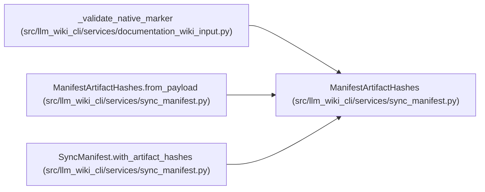

# ManifestArtifactHashes

**Location:** `src/llm_wiki_cli/services/sync_manifest.py:446`
**Kind:** Class
**Bases:** —
**Module:** [sync_manifest](../modules/sync_manifest.md)

**Decorators:** `@dataclass(frozen=True)`

## Description

All-or-none exact-byte commitment to the generated artifact set.

## Attributes

| Name | Type | Default | Description |
|------|------|---------|-------------|
| `surface_index_hash` | `str` | *required* | — |
| `knowledge_index_hash` | `str` | *required* | — |
| `evaluated_envelope_hash` | `str` | *required* | — |
| `governance_hash` | `str \| None` | `None` | — |

## Methods

| Method | Signature | Decorators | Description |
|--------|-----------|------------|-------------|
| `__post_init__` | `() -> None` | — | — |
| `to_payload` | `() -> dict[str, str]` | — | — |
| `from_payload` | `(value: object, field_name: str = 'artifact_hashes') -> ManifestArtifactHashes` | `@classmethod` | — |

## Relationships

<!-- Auto-generated relationship summary. Do not edit by hand. -->

### Summary

| Module | Methods | Attributes |
|---|---:|---|
| [sync_manifest](../modules/sync_manifest.md) | 3 | `evaluated_envelope_hash`, `governance_hash`, `knowledge_index_hash`, `surface_index_hash` |

### References

| Reference | Kind | Source | Call sites |
|---|---|---|---:|
| `_validate_native_marker` | type_reference | [documentation_wiki_input](../modules/documentation_wiki_input.md) | — |
| `ManifestArtifactHashes.from_payload` | type_reference | [sync_manifest](../modules/sync_manifest.md) | — |
| `SyncManifest.with_artifact_hashes` | call | [sync_manifest](../modules/sync_manifest.md) | 1 |
