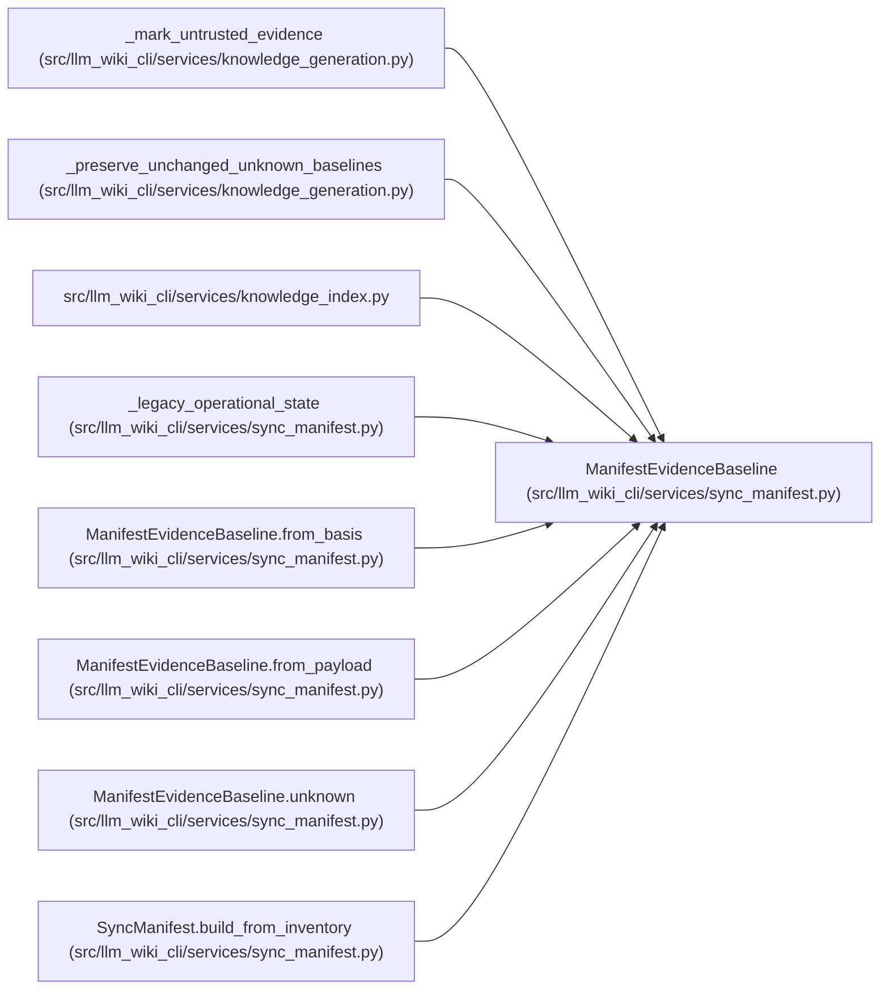

# ManifestEvidenceBaseline

**Location:** `src/llm_wiki_cli/services/sync_manifest.py:252`
**Kind:** Class
**Bases:** —
**Module:** [sync_manifest](../modules/sync_manifest.md)

**Decorators:** `@dataclass(frozen=True)`

## Description

Known or explicitly unknown evidence for one active concept page.

## Attributes

| Name | Type | Default | Description |
|------|------|---------|-------------|
| `basis` | `ConceptObservationBasis \| None` | `None` | — |
| `unknown_reason` | `str \| None` | `None` | — |

## Methods

| Method | Signature | Decorators | Description |
|--------|-----------|------------|-------------|
| `__post_init__` | `() -> None` | — | — |
| `is_known` | `() -> bool` | `@property` | — |
| `from_basis` | `(basis: ConceptObservationBasis) -> ManifestEvidenceBaseline` | `@classmethod` | — |
| `unknown` | `(reason: str, *, basis: ConceptObservationBasis \| None = None) -> ManifestEvidenceBaseline` | `@classmethod` | — |
| `to_payload` | `() -> dict[str, object]` | — | — |
| `from_payload` | `(value: object, field_name: str) -> ManifestEvidenceBaseline` | `@classmethod` | — |

## Relationships

<!-- Auto-generated relationship summary. Do not edit by hand. -->

### Summary

| Module | Methods | Attributes |
|---|---:|---|
| [sync_manifest](../modules/sync_manifest.md) | 6 | `basis`, `unknown_reason` |

### References

| Reference | Kind | Source | Call sites |
|---|---|---|---:|
| `_mark_untrusted_evidence` | type_reference | [knowledge_generation](../modules/knowledge_generation.md) | — |
| `_preserve_unchanged_unknown_baselines` | type_reference | [knowledge_generation](../modules/knowledge_generation.md) | — |
| `knowledge_index` | import | [knowledge_index](../modules/knowledge_index.md) | — |
| `_legacy_operational_state` | type_reference | [sync_manifest](../modules/sync_manifest.md) | — |
| `ManifestEvidenceBaseline.from_basis` | type_reference | [sync_manifest](../modules/sync_manifest.md) | — |
| `ManifestEvidenceBaseline.from_payload` | type_reference | [sync_manifest](../modules/sync_manifest.md) | — |
| `ManifestEvidenceBaseline.unknown` | type_reference | [sync_manifest](../modules/sync_manifest.md) | — |
| `SyncManifest.build_from_inventory` | type_reference | [sync_manifest](../modules/sync_manifest.md) | — |
