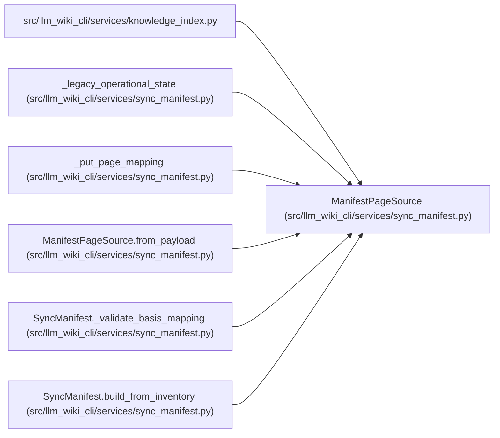

# ManifestPageSource

**Location:** `src/llm_wiki_cli/services/sync_manifest.py:147`
**Kind:** Class
**Bases:** —
**Module:** [sync_manifest](../modules/sync_manifest.md)

**Decorators:** `@dataclass(frozen=True)`

## Description

Last observed source coordinate for one module or entity page.

## Attributes

| Name | Type | Default | Description |
|------|------|---------|-------------|
| `scope` | `str` | *required* | — |
| `source_path` | `str` | *required* | — |
| `entity_name` | `str \| None` | `None` | — |
| `occurrence` | `int \| None` | `None` | — |

## Methods

| Method | Signature | Decorators | Description |
|--------|-----------|------------|-------------|
| `__post_init__` | `() -> None` | — | — |
| `to_payload` | `() -> dict[str, object]` | — | — |
| `from_payload` | `(value: object, field_name: str) -> ManifestPageSource` | `@classmethod` | — |

## Relationships

<!-- Auto-generated relationship summary. Do not edit by hand. -->

### Summary

| Module | Methods | Attributes |
|---|---:|---|
| [sync_manifest](../modules/sync_manifest.md) | 3 | `entity_name`, `occurrence`, `scope`, `source_path` |

### References

| Reference | Kind | Source | Call sites |
|---|---|---|---:|
| `knowledge_index` | import | [knowledge_index](../modules/knowledge_index.md) | — |
| `_legacy_operational_state` | call | [sync_manifest](../modules/sync_manifest.md) | 3 |
| `_legacy_operational_state` | type_reference | [sync_manifest](../modules/sync_manifest.md) | — |
| `_put_page_mapping` | type_reference | [sync_manifest](../modules/sync_manifest.md) | — |
| `ManifestPageSource.from_payload` | type_reference | [sync_manifest](../modules/sync_manifest.md) | — |
| `SyncManifest._validate_basis_mapping` | type_reference | [sync_manifest](../modules/sync_manifest.md) | — |
| `SyncManifest.build_from_inventory` | call | [sync_manifest](../modules/sync_manifest.md) | 2 |
