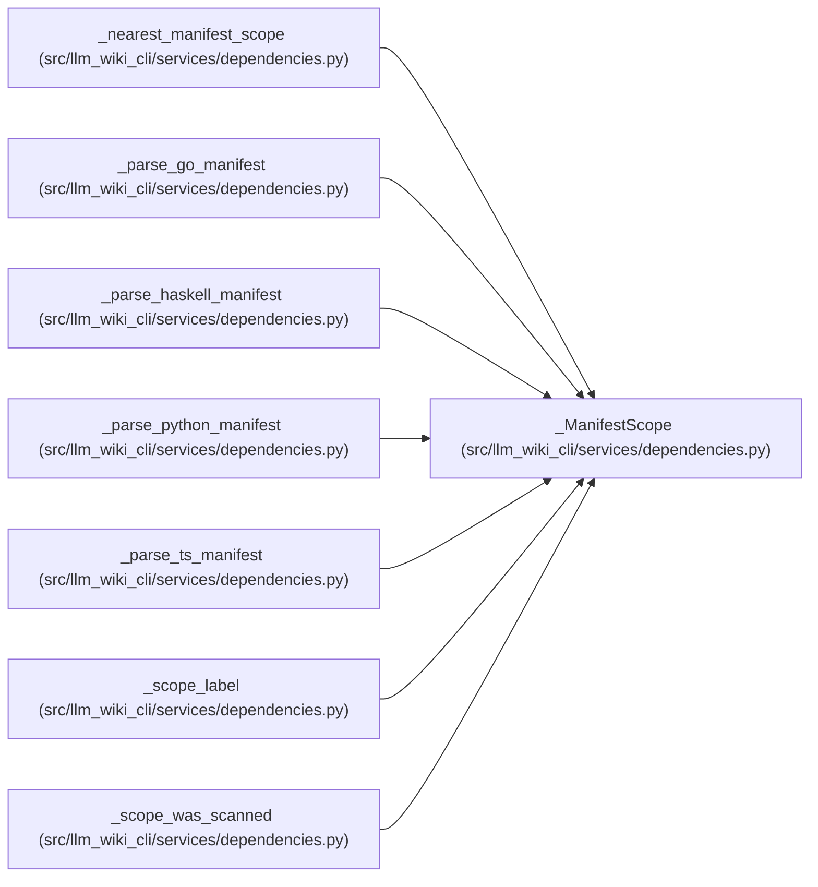

# _ManifestScope

**Location:** `src/llm_wiki_cli/services/dependencies.py:757`
**Kind:** Class
**Bases:** —
**Module:** [services_dependencies](../modules/services_dependencies.md)

**Decorators:** `@dataclass(frozen=True)`

## Description

A scoped dependency manifest rooted at a project-relative directory.

## Attributes

| Name | Type | Default | Description |
|------|------|---------|-------------|
| `root` | `str` | *required* | — |
| `required` | `frozenset[str]` | *required* | — |
| `optional` | `frozenset[str]` | *required* | — |
| `aliases` | `Optional[dict[str, str]]` | `None` | — |
| `distribution` | `str` | `''` | — |
| `import_roots` | `frozenset[str]` | `frozenset()` | — |
| `own_module` | `str` | `''` | — |
| `internal_modules` | `frozenset[str]` | `frozenset()` | — |

## Methods

*No public methods. Inherits from base classes.*

## Relationships

<!-- Auto-generated relationship summary. Do not edit by hand. -->

### Summary

| Module | Methods | Attributes |
|---|---:|---|
| [services_dependencies](../modules/services_dependencies.md) | 0 | `aliases`, `distribution`, `import_roots`, `internal_modules`, `optional`, `own_module`, `required`, `root` |

### References

| Reference | Kind | Source | Call sites |
|---|---|---|---:|
| `_nearest_manifest_scope` | type_reference | [services_dependencies](../modules/services_dependencies.md) | — |
| `_parse_go_manifest` | call | [services_dependencies](../modules/services_dependencies.md) | 1 |
| `_parse_haskell_manifest` | call | [services_dependencies](../modules/services_dependencies.md) | 1 |
| `_parse_python_manifest` | call | [services_dependencies](../modules/services_dependencies.md) | 1 |
| `_parse_ts_manifest` | call | [services_dependencies](../modules/services_dependencies.md) | 1 |
| `_scope_label` | type_reference | [services_dependencies](../modules/services_dependencies.md) | — |
| `_scope_was_scanned` | type_reference | [services_dependencies](../modules/services_dependencies.md) | — |
