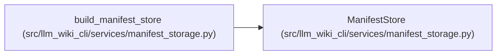

# ManifestStore

**Location:** `src/llm_wiki_cli/services/manifest_storage.py:77`
**Kind:** Class
**Bases:** —
**Module:** [manifest_storage](../modules/manifest_storage.md)

**Decorators:** `@dataclass(frozen=True)`

## Description

Carries the bounded v6 root bytes and immutable catalog bytes produced from a complete logical v5 manifest. The owning writer publishes catalog objects before replacing the single manifest commit root.

## Attributes

| Name | Type | Default | Description |
|------|------|---------|-------------|
| `root_bytes` | `bytes` | *required* | — |
| `objects` | `Mapping[str, bytes]` | *required* | — |

## Methods

*No public methods. Inherits from base classes.*

## Relationships

<!-- Auto-generated relationship summary. Do not edit by hand. -->

### Summary

| Module | Methods | Attributes |
|---|---:|---|
| [manifest_storage](../modules/manifest_storage.md) | 0 | `objects`, `root_bytes` |

### References

| Reference | Kind | Source | Call sites |
|---|---|---|---:|
| `build_manifest_store` | call | [manifest_storage](../modules/manifest_storage.md) | 1 |
| `build_manifest_store` | type_reference | [manifest_storage](../modules/manifest_storage.md) | — |
