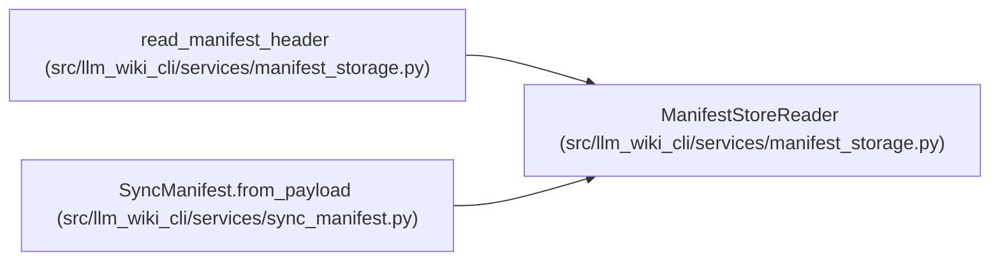

# ManifestStoreReader

**Location:** `src/llm_wiki_cli/services/manifest_storage.py:143`
**Kind:** Class
**Bases:** —
**Module:** [manifest_storage](../modules/manifest_storage.md)

## Description

Authenticates bounded immutable manifest catalogs and reconstructs complete field values. It enforces catalog commitments, canonical encoding, expansion accounting and tree limits. Full materialization verifies the logical v5 commitment; header consumers request only the policy field they need.

## Attributes

*No annotated attributes found.*

## Methods

| Method | Signature | Decorators | Description |
|--------|-----------|------------|-------------|
| `__init__` | `(root: Mapping[str, Any], read: Reader)` | — | — |
| `_chunks` | `(desc: dict[str, Any], depth: int = 0)` | — | — |
| `field` | `(name: str) -> dict[str, Any]` | — | — |
| `materialize` | `() -> dict[str, Any]` | — | — |

## Relationships

<!-- Auto-generated relationship summary. Do not edit by hand. -->

### Summary

| Module | Methods | Attributes |
|---|---:|---|
| [manifest_storage](../modules/manifest_storage.md) | 4 | — |

### References

| Reference | Kind | Source | Call sites |
|---|---|---|---:|
| `read_manifest_header` | call | [manifest_storage](../modules/manifest_storage.md) | 1 |
| `SyncManifest.from_payload` | call | [sync_manifest](../modules/sync_manifest.md) | 1 |
