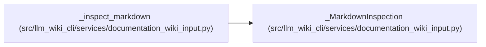

# _MarkdownInspection

**Location:** `src/llm_wiki_cli/services/documentation_wiki_input.py:438`
**Kind:** Class
**Bases:** —
**Module:** [documentation_wiki_input](../modules/documentation_wiki_input.md)

**Decorators:** `@dataclass(frozen=True)`

## Description

_Auto-generated from `_MarkdownInspection` in `src/llm_wiki_cli/services/documentation_wiki_input.py`._

## Attributes

| Name | Type | Default | Description |
|------|------|---------|-------------|
| `semantic_paths` | `tuple[str, ...]` | *required* | — |
| `generated_marker_counts` | `Mapping[str, int]` | *required* | — |
| `generated_markers` | `Mapping[str, Any]` | *required* | — |
| `semantic_file_count` | `int` | *required* | — |
| `semantic_total_bytes` | `int` | *required* | — |

## Methods

*No public methods. Inherits from base classes.*

## Relationships

<!-- Auto-generated relationship summary. Do not edit by hand. -->

### Summary

| Module | Methods | Attributes |
|---|---:|---|
| [documentation_wiki_input](../modules/documentation_wiki_input.md) | 0 | `generated_marker_counts`, `generated_markers`, `semantic_file_count`, `semantic_paths`, `semantic_total_bytes` |

### References

| Reference | Kind | Source |
|---|---|---|
| `_inspect_markdown` | call | [documentation_wiki_input](../modules/documentation_wiki_input.md) |
| `_inspect_markdown` | type_reference | [documentation_wiki_input](../modules/documentation_wiki_input.md) |
