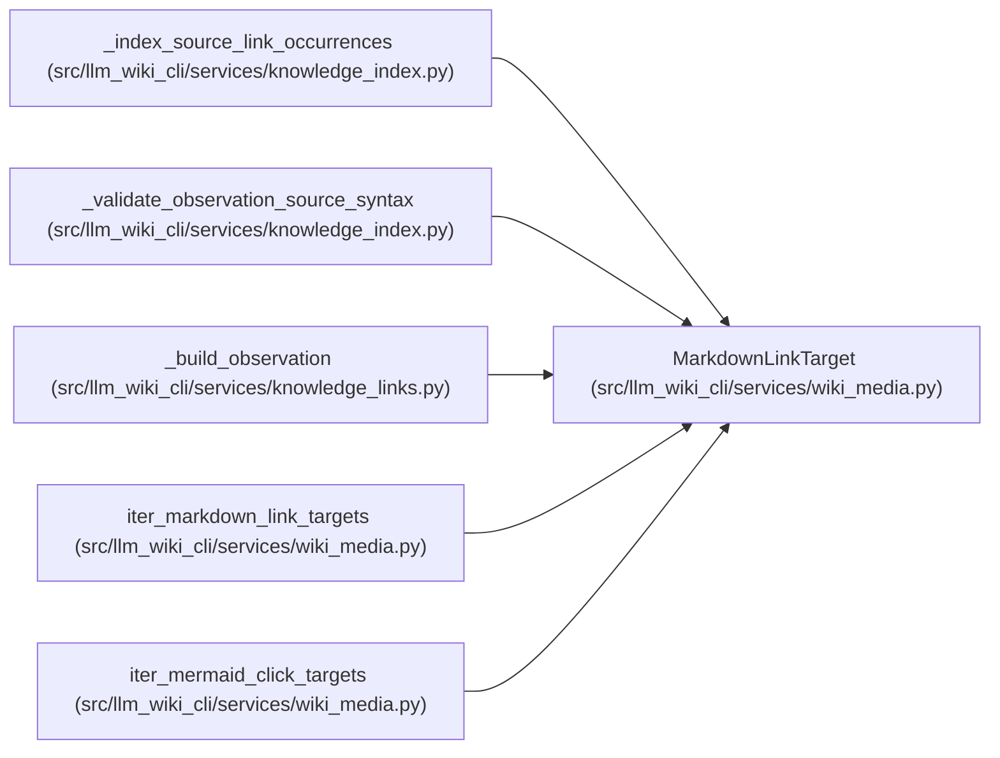

# MarkdownLinkTarget

**Location:** `src/llm_wiki_cli/services/wiki_media.py:52`
**Kind:** Class
**Bases:** —
**Module:** [wiki_media](../modules/wiki_media.md)

**Decorators:** `@dataclass(frozen=True)`

## Description

_Auto-generated from `MarkdownLinkTarget` in `src/llm_wiki_cli/services/wiki_media.py`._

## Attributes

| Name | Type | Default | Description |
|------|------|---------|-------------|
| `raw_target` | `str` | *required* | — |
| `target` | `str` | *required* | — |
| `label` | `str` | *required* | — |
| `is_image` | `bool` | *required* | — |
| `start` | `int` | *required* | — |
| `end` | `int` | *required* | — |

## Methods

*No public methods. Inherits from base classes.*

## Relationships

<!-- Auto-generated relationship summary. Do not edit by hand. -->

### Summary

| Module | Methods | Attributes |
|---|---:|---|
| [wiki_media](../modules/wiki_media.md) | 0 | `end`, `is_image`, `label`, `raw_target`, `start`, `target` |

### References

| Reference | Kind | Source | Call sites |
|---|---|---|---:|
| `_index_source_link_occurrences` | type_reference | [knowledge_index](../modules/knowledge_index.md) | — |
| `_validate_observation_source_syntax` | type_reference | [knowledge_index](../modules/knowledge_index.md) | — |
| `_build_observation` | type_reference | [knowledge_links](../modules/knowledge_links.md) | — |
| `iter_markdown_link_targets` | call | [wiki_media](../modules/wiki_media.md) | 1 |
| `iter_markdown_link_targets` | type_reference | [wiki_media](../modules/wiki_media.md) | — |
| `iter_mermaid_click_targets` | call | [wiki_media](../modules/wiki_media.md) | 1 |
| `iter_mermaid_click_targets` | type_reference | [wiki_media](../modules/wiki_media.md) | — |
