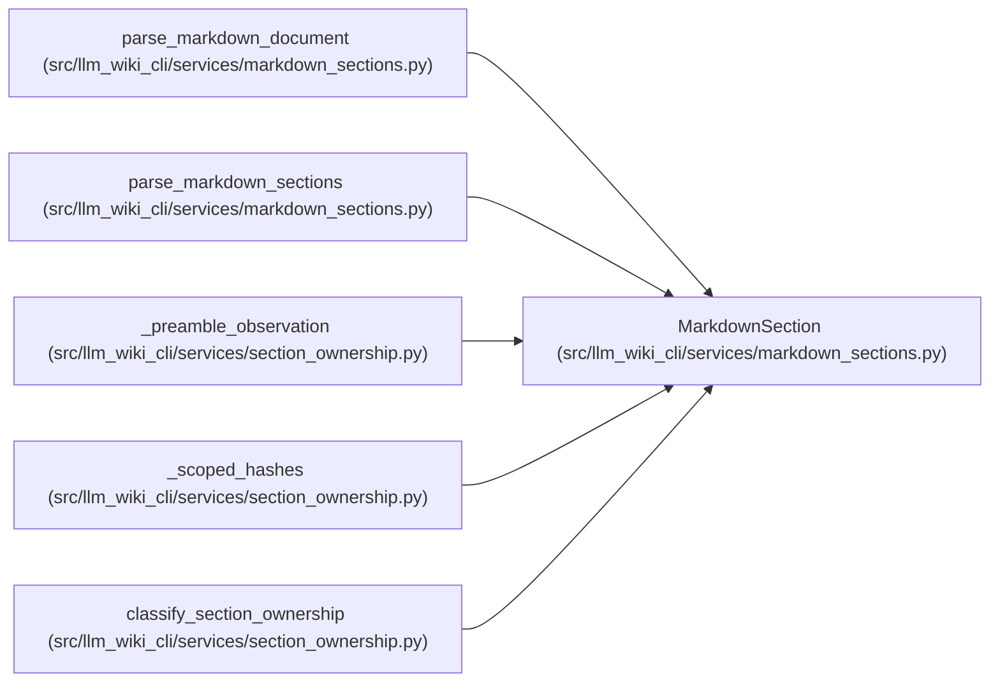

# MarkdownSection

**Location:** `src/llm_wiki_cli/services/markdown_sections.py:85`
**Kind:** Class
**Bases:** —
**Module:** [markdown_sections](../modules/markdown_sections.md)

**Decorators:** `@dataclass(frozen=True)`

## Description

One ATX heading and its exact normalized section extent.

``exact_text`` begins at the opening heading and ends immediately before
the next heading of the same or shallower level (or at EOF).  It therefore
includes nested sections and every blank line in that extent.

## Attributes

| Name | Type | Default | Description |
|------|------|---------|-------------|
| `page_locator` | `str` | *required* | — |
| `locator` | `str` | *required* | — |
| `ordinal` | `int` | *required* | — |
| `level` | `int` | *required* | — |
| `title` | `str` | *required* | — |
| `heading_path` | `tuple[str, ...]` | *required* | — |
| `occurrence_path` | `tuple[int, ...]` | *required* | — |
| `sibling_occurrence` | `int` | *required* | — |
| `parent_locator` | `str \| None` | *required* | — |
| `child_locators` | `tuple[str, ...]` | *required* | — |
| `start` | `int` | *required* | — |
| `body_start` | `int` | *required* | — |
| `end` | `int` | *required* | — |
| `start_byte` | `int` | *required* | — |
| `body_start_byte` | `int` | *required* | — |
| `end_byte` | `int` | *required* | — |
| `heading_text` | `str` | *required* | — |
| `body` | `str` | *required* | — |
| `exact_text` | `str` | *required* | — |
| `exact_bytes` | `bytes` | *required* | — |
| `exact_hash` | `str` | *required* | — |

## Methods

| Method | Signature | Decorators | Description |
|--------|-----------|------------|-------------|
| `section_hash` | `() -> str` | `@property` | Compatibility alias for the exact normalized section hash. |
| `occurrence` | `() -> int` | `@property` | Compatibility alias for :attr:`sibling_occurrence`. |
| `path` | `() -> tuple[str, ...]` | `@property` | Compatibility alias for :attr:`heading_path`. |
| `to_payload` | `() -> dict[str, object]` | — | Return a deterministic, JSON-friendly section commitment. |

## Relationships

<!-- Auto-generated relationship summary. Do not edit by hand. -->

### Summary

| Module | Methods | Attributes |
|---|---:|---|
| [markdown_sections](../modules/markdown_sections.md) | 4 | `body`, `body_start`, `body_start_byte`, `child_locators`, `end`, `end_byte`, `exact_bytes`, `exact_hash`, `exact_text`, `heading_path`, `heading_text`, `level` |

### References

| Reference | Kind | Source | Call sites |
|---|---|---|---:|
| `parse_markdown_document` | call | [markdown_sections](../modules/markdown_sections.md) | 1 |
| `parse_markdown_document` | type_reference | [markdown_sections](../modules/markdown_sections.md) | — |
| `parse_markdown_sections` | type_reference | [markdown_sections](../modules/markdown_sections.md) | — |
| `_preamble_observation` | type_reference | [section_ownership](../modules/section_ownership.md) | — |
| `_scoped_hashes` | type_reference | [section_ownership](../modules/section_ownership.md) | — |
| `classify_section_ownership` | type_reference | [section_ownership](../modules/section_ownership.md) | — |
