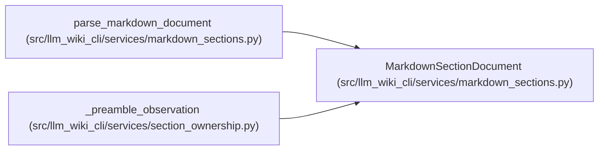

# MarkdownSectionDocument

**Location:** `src/llm_wiki_cli/services/markdown_sections.py:155`
**Kind:** Class
**Bases:** —
**Module:** [markdown_sections](../modules/markdown_sections.md)

**Decorators:** `@dataclass(frozen=True)`

## Description

Normalized Markdown plus its ordered hierarchy commitment.

## Attributes

| Name | Type | Default | Description |
|------|------|---------|-------------|
| `page_locator` | `str` | *required* | — |
| `normalized_markdown` | `str` | *required* | — |
| `normalized_bytes` | `bytes` | *required* | — |
| `exact_hash` | `str` | *required* | — |
| `sections` | `tuple[MarkdownSection, ...]` | *required* | — |
| `ordering_hash` | `str` | *required* | — |

## Methods

| Method | Signature | Decorators | Description |
|--------|-----------|------------|-------------|
| `__iter__` | `()` | — | — |
| `__len__` | `() -> int` | — | — |
| `__getitem__` | `(index)` | — | — |

## Relationships

<!-- Auto-generated relationship summary. Do not edit by hand. -->

### Summary

| Module | Methods | Attributes |
|---|---:|---|
| [markdown_sections](../modules/markdown_sections.md) | 3 | `exact_hash`, `normalized_bytes`, `normalized_markdown`, `ordering_hash`, `page_locator`, `sections` |

### References

| Reference | Kind | Source | Call sites |
|---|---|---|---:|
| `parse_markdown_document` | call | [markdown_sections](../modules/markdown_sections.md) | 1 |
| `parse_markdown_document` | type_reference | [markdown_sections](../modules/markdown_sections.md) | — |
| `_preamble_observation` | type_reference | [section_ownership](../modules/section_ownership.md) | — |
