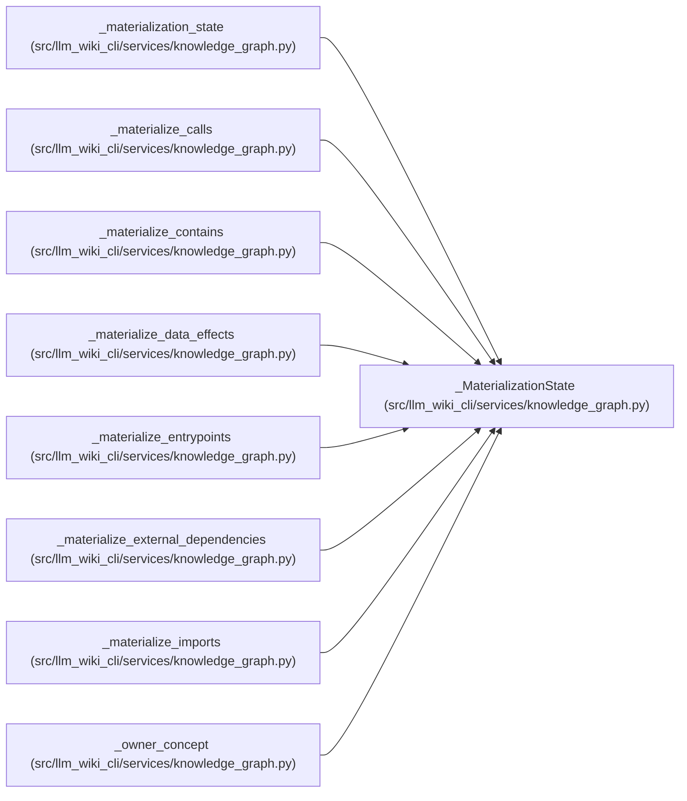

# _MaterializationState

**Location:** `src/llm_wiki_cli/services/knowledge_graph.py:204`
**Kind:** Class
**Bases:** —
**Module:** [knowledge_graph](../modules/knowledge_graph.md)

**Decorators:** `@dataclass`

## Description

_Auto-generated from `_MaterializationState` in `src/llm_wiki_cli/services/knowledge_graph.py`._

## Attributes

| Name | Type | Default | Description |
|------|------|---------|-------------|
| `inputs` | `KnowledgeGraphInputs` | *required* | — |
| `concepts` | `tuple[GraphConcept, ...]` | *required* | — |
| `input_hashes` | `dict[str, str]` | *required* | — |
| `module_by_source` | `dict[str, GraphConcept]` | *required* | — |
| `entities_by_source_symbol` | `dict[tuple[str, str], tuple[GraphConcept, ...]]` | *required* | — |
| `flow_by_id` | `dict[str, GraphConcept]` | *required* | — |
| `edges` | `dict[str, _EdgeAccumulator]` | `field(default_factory=dict)` | — |
| `coverage` | `dict[str, dict[str, Any]]` | `field(default_factory=dict)` | — |

## Methods

| Method | Signature | Decorators | Description |
|--------|-----------|------------|-------------|
| `add_edge` | `(*, analyzer: str, kind: str, source: Mapping[str, Any], target: Mapping[str, Any], origin: str, resolution: str, sample: Mapping[str, Any], limitations: Iterable[str] = ()) -> None` | — | — |

## Relationships

<!-- Auto-generated relationship summary. Do not edit by hand. -->

### Summary

| Module | Methods | Attributes |
|---|---:|---|
| [knowledge_graph](../modules/knowledge_graph.md) | 1 | `concepts`, `coverage`, `edges`, `entities_by_source_symbol`, `flow_by_id`, `input_hashes`, `inputs`, `module_by_source` |

### References

| Reference | Kind | Source |
|---|---|---|
| `_materialization_state` | call | [knowledge_graph](../modules/knowledge_graph.md) |
| `_materialization_state` | type_reference | [knowledge_graph](../modules/knowledge_graph.md) |
| `_materialize_calls` | type_reference | [knowledge_graph](../modules/knowledge_graph.md) |
| `_materialize_contains` | type_reference | [knowledge_graph](../modules/knowledge_graph.md) |
| `_materialize_data_effects` | type_reference | [knowledge_graph](../modules/knowledge_graph.md) |
| `_materialize_entrypoints` | type_reference | [knowledge_graph](../modules/knowledge_graph.md) |
| `_materialize_external_dependencies` | type_reference | [knowledge_graph](../modules/knowledge_graph.md) |
| `_materialize_imports` | type_reference | [knowledge_graph](../modules/knowledge_graph.md) |
| `_owner_concept` | type_reference | [knowledge_graph](../modules/knowledge_graph.md) |
