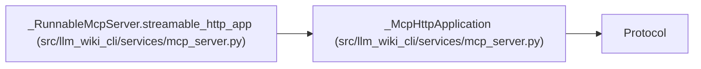

# _McpHttpApplication

**Location:** `src/llm_wiki_cli/services/mcp_server.py:226`
**Kind:** Class
**Bases:** `Protocol`
**Module:** [mcp_server](../modules/mcp_server.md)

## Description

_Auto-generated from `_McpHttpApplication` in `src/llm_wiki_cli/services/mcp_server.py`._

## Attributes

*No annotated attributes found.*

## Methods

| Method | Signature | Decorators | Description |
|--------|-----------|------------|-------------|
| `add_middleware` | `(middleware_class: type[object], **options: object) -> None` | — | — |

## Relationships

<!-- Auto-generated relationship summary. Do not edit by hand. -->

### Summary

| Module | Methods | Attributes |
|---|---:|---|
| [mcp_server](../modules/mcp_server.md) | 1 | — |

### Structure

| Kind | Entity | Module |
|---|---|---|
| Base | `Protocol` | — |

### References

| Reference | Kind | Source | Call sites |
|---|---|---|---:|
| `_RunnableMcpServer.streamable_http_app` | type_reference | [mcp_server](../modules/mcp_server.md) | — |
